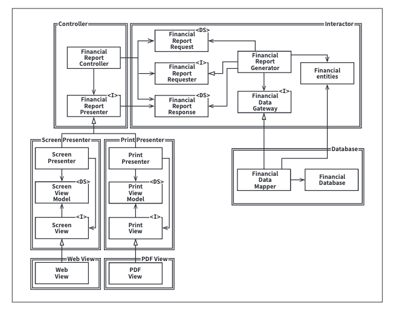
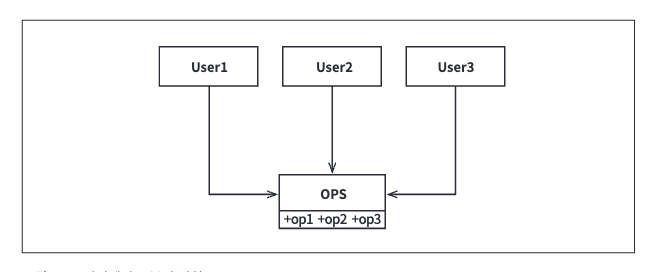

# 2. 프로그래밍 패러다임

## 3장. 패러다임 개요

### 구조적 프로그래밍
- 에츠허르 비버 데이크스트라가 발견.
- 제어흐름의 직접적인 전환에 대해 규칙을 부과함.

### 객체 지향 프로그래밍
- 구조적 프로그래밍보다 2년 앞선 1966년 등장.
- 제어흐름의 간접적인 전환에 대해 규칙을 부과함.

### 함수형 프로그래밍
- 세 패러다임 중 가장 먼저 만들어졌으나 최근에서야 도입.
- 람다 계산법에 기초하여 만들어짐.
- 할당문에 대해 규칙을 부과함.

패러다임은 무엇을 해야 할지를 말하기보다는 무엇을 해서는 안 되는지를 말해준다.

## 4장. 구조적 프로그래밍

### 데이크스트라의 증명
- 데이크스트라는 goto문장이 모듈을 더 작은 단위로 재귀적으로 분해하는 과정에 방해가 된다는 사실을 발견했다.
- 또한, 모든 프로그램은 순차, 분기, 반복 이라는 세 가지 구조만으로 표현할 수 있다는 사실을 증명했다.

### 기능적 분해
- 거대한 문제 기술서를 받더라도 문제를 고수준의 기능들로 분해하고 이를 다시 저수준의 함수들로 분해하는 과정을 반복하며
이렇게 분해된 기능들은 구조적 프로그래밍의 제한된 제어구조를 이용하여 표현할 수 있다.

### 테스트
- 데이크스트라는 다음과 같이 말했다.
`테스트는 버그가 있음을 보여줄 뿐, 버그가 없음을 보여줄 수는 없다.`
- 즉, 프로그램이 잘못되었음을 테스트를 통해 보여줄 수는 있지만 프로그램이 맞다고 증명할 수는 없다.

### 결론
- 가장 작은 기능에서부터 가장 큰 컴포넌트에 이르기까지 모든 수준에서 소프트웨어는 과학과 같고,
따라서 반증 가능성에 의해 주도된다.
**- 소프트웨어 아키텍트는 모듈, 컴포넌트, 서비스가 쉽게 반증 가능하도록 만들기 위해 분주히 노력해야 한다.**

### 순차적 프로그래밍 vs 절차적 프로그래밍 vs 구조적 프로그래밍
1. 순차적 프로그래밍
```java
 public class SequentialExample {
    public static void main(String[] args) {
        // 1. 두 수를 정의
        int num1 = 10;
        int num2 = 20;

        // 2. 두 수를 더함
        int sum = num1 + num2;

        // 3. 두 수를 곱함
        int product = num1 * num2;

        // 4. 결과 출력
        System.out.println("Sum: " + sum);
        System.out.println("Product: " + product);
    }
}
```
- 모든 명령문이 순서대로 실행되며 제어흐름을 변경할 수 없다.

2. 절차적 프로그래밍
```java
import java.util.Scanner;

public class ProceduralExample {
    public static void main(String[] args) {
        Scanner scanner = new Scanner(System.in);

        // 사용자 입력 받기
        System.out.print("Enter the first number: ");
        int num1 = scanner.nextInt();
        System.out.print("Enter the second number: ");
        int num2 = scanner.nextInt();

        // 두 수 더하기
        int sum = addNumbers(num1, num2);

        // 두 수 곱하기
        int product = multiplyNumbers(num1, num2);

        // 결과 출력
        System.out.println("Sum: " + sum);
        System.out.println("Product: " + product);

        scanner.close();
    }

    // 두 수를 더하는 함수
    public static int addNumbers(int a, int b) {
        return a + b;
    }

    // 두 수를 곱하는 함수
    public static int multiplyNumbers(int a, int b) {
        return a * b;
    }
}
```
- 코드가 절차(함수, 메서드)로 나뉘어 있으며 각 절차는 특정 작업을 수행한다.


3. 구조적 프로그래밍
```java
import java.util.Scanner;

public class StructuredExample {

    public static void main(String[] args) {
        Scanner scanner = new Scanner(System.in);

        // 입력 받기
        int num1 = getInput(scanner, "Enter the first number: ");
        int num2 = getInput(scanner, "Enter the second number: ");

        // 연산 및 출력
        displayResult(num1, num2);

        scanner.close();
    }

    // 사용자로부터 입력을 받는 함수
    public static int getInput(Scanner scanner, String prompt) {
        System.out.print(prompt);
        return scanner.nextInt();
    }

    // 두 수를 더하고 곱한 결과를 출력하는 함수
    public static void displayResult(int num1, int num2) {
        int sum = addNumbers(num1, num2);
        int product = multiplyNumbers(num1, num2);
        System.out.println("Sum: " + sum);
        System.out.println("Product: " + product);
    }

    // 두 수를 더하는 함수
    public static int addNumbers(int a, int b) {
        return a + b;
    }

    // 두 수를 곱하는 함수
    public static int multiplyNumbers(int a, int b) {
        return a * b;
    }
}
```
- 절차적 프로그래밍의 한 형태로, 제어 구조를 명확히 하여 코드의 가독성과 유지보수성을 높임.
- 함수로 나누어져 있으며 각 함수가 특정 작업을 수행함.

## 5장. 객체 지향 프로그래밍

### 캡슐화
- C언어를 사용하면 완벽한 캡슐화가 가능하다.
```java
// point.h
struct Point;
struct Point* makePoint(int x, int y);
double distance(struct Point* p1, struct Point* p2);

// point.c
#include "point.h"
#include <math.h>
#include <stdlib.h>

struct Point {
    int x;
    int y;
};

struct Point* makePoint(int x, int y) {
    struct Point* p = (struct Point*)malloc(sizeof(struct Point));
    p->x = x;
    p->y = y;
    return p;
}

double distance(struct Point* p1, struct Point* p2) {
    return sqrt((p1->x - p2->x) * (p1->x - p2->x) + (p1->y - p2->y) * (p1->y - p2->y));
} 
```
- point.h를 사용하는 측에서는 struct Point의 멤버에 접근할 방법이 전혀 없다.
- 사용자는 makePoint(), distance()를 호출할 수는 있지만 struct Point의 멤버에 직접 접근할 수는 없다.
- 이러한 방식이 완전한 캡슐화이다.
- -----------------------------------------------------
- 하지만, C++이 등장하면서 완전한 캡슐화가 깨지게 되었다.
- C++은 헤더 파일에 멤버 변수를 선언하고 구현 파일에 멤버 변수를 정의하는 방식을 사용한다.
- 이러한 방식은 멤버 변수의 이름이 바뀐다면 헤더 파일과 구현 파일을 모두 다시 컴파일해야 하는 번거로움이 있다.
- -----------------------------------------------------
- 자바와 C#은 헤더와 구현체를 분리하는 방식을 아예 버렸으며 이로 인해 캡슐화는 더 심하게 훼손되었다.

### 상속
```java
// namedPoint.h
struct NamedPoint;

struct NamedPoint* makeNamedPoint(int x, int y, const char* name);
void setName(struct NamedPoint* np, char* name);
char* getName(struct NamedPoint* np);

// namedPoint.c
#include "namedPoint.h"
#include <stdlib.h>

struct NamedPoint {
    double x,y;
    char* name;
};

struct NamedPoint* makeNamedPoint(int x, int y, const char* name) {
    struct NamedPoint* np = (struct NamedPoint*)malloc(sizeof(struct NamedPoint));
    np->x = x;
    np->y = y;
    np->name = (char*)malloc(strlen(name) + 1);
    strcpy(np->name, name);
    return np;
}

void setName(struct NamedPoint* np, char* name) {
    free(np->name);
    np->name = (char*)malloc(strlen(name) + 1);
    strcpy(np->name, name);
}

char* getName(struct NamedPoint* np) {
    return np->name;
}

// main.c
#include "point.h"
#include "namedPoint.h"
#include <stdio.h>

int main(int ac, char** av) {
    struct NamedPoint* np = makeNamedPoint(3, 4, "foo");
    struct NamePoint* upperRight = makeNamePoint(10, 20, "bar");
    printf("distance = %f\n", distance(np, upperRight));
}
```
- main 프로그램을 잘 살펴보면 NamedPoint 구조가 마치 Point 데이터 구조로부터 파생된 구조인 것처럼 동작한다는 것을 알 수 있다.
- 이 방식은 정식적인 상속이 등장하기 전부터 흔하게 사용되던 기법이다.
- 하지만 이 방식은 실제 상속만큼 편리한 방식이 아니며 다중 상속을 구현하기 어려웠다.

### 다형성
- 1940년대 폰 노이만 아키텍처가 처음 구현된 이후 프로그래머는 다형적 행위를 수행하기 위해
함수를 가리키는 포인터를 사용해 왔으며 이 포인터를 응용한 것이 다형성이다.
- 플러그인 아키텍처는 다형성을 사용하여 구현된 대표적인 예시이며 입출력 장치 독립성을 지원하기 위해 만들어졌다.
- 하지만 대부분의 프로그래머는 직접 작성하는 프로그램에서 이러한 개념을 적용하지 않았는데 함수를 가리키는 포인터를 사용하면 위험이 수반되기 때문이다.

### 의존성 역전
- 다형성을 안전하고 편리하게 적용할 수 있는 매커니즘이 등장하기 전 소프트웨어의 호출 트리에서 의존성 방향은 반드시 제어흐름을 따르게 되었다.


- main 함수가 고수준 함수를 호출하려면 고수준 함수가 포함된 모듈의 이름을 지정해야 하는데 C의 경우 include, 자바에서는 import를 사용한다.


- HL1 모듈은 인터페이스를 통해 F함수를 호출하는데 이 인터페이스는 런타임에는 존재하지 않는다.
- 여기서 ML1과 I 인터페이스 사이의 소스 코드 의존성이 제어흐름과는 반대인 것이 의존성 역전이다.
- 의존성 역전을 적용하면 각 모듈별로 독립적인 배포가 가능하며 서로 다른 팀에서 각 모듈을 동시에 개발할 수 있다.

### 의존성 역전 원칙이 적용되지 않은 코드 vs 적용된 코드

1. 의존성 역전 원칙이 적용되지 않은 코드
```java
// Service 인터페이스
public interface Service {
    void execute();
}

// ConcreteService 클래스
public class ConcreteService implements Service {
    @Override
    public void execute() {
        System.out.println("Executing service...");
    }
}

// Application 클래스
public class Application {
    private ConcreteService service;

    public Application() {
        this.service = new ConcreteService();
    }

    public void run() {
        service.execute();
    }

    public static void main(String[] args) {
        Application app = new Application();
        app.run();
    }
}
```
- Application 클래스가 ConcreteService 클래스에 직접 의존하기 때문에 ConcreteService가 변경될 때마다
Application 클래스도 변경되어야 한다.

2. 의존성 역전 원칙이 적용된 코드
```java
// Service 인터페이스
public interface Service {
    void execute();
}

// ConcreteService 클래스
public class ConcreteService implements Service {
    @Override
    public void execute() {
        System.out.println("Executing service...");
    }
}

// ServiceFactory 인터페이스
public interface ServiceFactory {
    Service getService();
}

// ConcreteServiceFactory 클래스

public class ConcreteServiceFactory implements ServiceFactory {
    @Override
    public Service getService() {
        return new ConcreteService();
    }
}

// Application 클래스
public class Application {
    private ServiceFactory serviceFactory;

    public Application(ServiceFactory serviceFactory) {
        this.serviceFactory = serviceFactory;
    }

    public void run() {
        Service service = serviceFactory.getService();
        service.execute();
    }

    public static void main(String[] args) {
        ServiceFactory serviceFactory = new ConcreteServiceFactory();
        Application app = new Application(serviceFactory);
        app.run();
    }
}

```
- Application 클래스가 ConcreteService의 구체적은 구현에 의존하지 않도록 하여 유연성과 확장성을 확보한다.

## 6장. 함수형 프로그래밍
- 함수형 언어에서 변수는 변경되지 않고 객체 지향 언어에서는 변수가 변경된다.
- 이러한 가변 변수의 존재는 경합 조건, 교착상태, 동시 업데이트 문제를 발생시킨다.

### 가변성의 분리
- 불변성과 관련하여 가장 주요한 타협 중 하나는 가변 컴포넌트와 불변 컴포넌트를 분리하는 것인데
불편 컴포넌트는 순수하게 함수형 방식으로만 작업이 처리되며, 어떤 가변 변수도 사용되지 않는다.

- 상태 변경의 동시성 문제를 해결하기 위해서 `트랜잭션 메모리`와 같은 실천법을 사용하여 동시 업데이트와 경합 조건 문제로부터 가변 변수를 보호한다.
- 트랜잭션 메모리는 데이터베이스가 디스크의 레코드를 다루는 방식과 동일한 방식으로 메모리의 변수를 처리한다.
- 트랜잭션을 사용하거나 또는 재시도 기법을 통해 변수를 보호한다.
- 현명한 아키텍트는 가능한 많은 처리를 불변 컴포넌트로 옮기고 가변 컴포넌트에서 가능한 많은 코드를 빼야 한다.

### 이벤트 소싱
- 이벤트 소싱은 상태가 아닌 트랜잭션을 저장하는 의미이다.
- 상태가 필요해지면 단순히 상태의 시작점부터 모든 트랙잭션을 처리하여 결과를 구한다.
- 이는 많은 저장공간이 필요하며 애플리케이션이 CRUD 중 CR만 수행한다는 특징이 있다.

# 3. 설계 원칙

> SOLID 원칙은 함수와 데이터 구조를 클래스로 배치하는 방법, 그리고 이들 클래스를 서로 결합하는 방법을 설명한다.
>
> SOLID 원칙의 목적은 중간 수준의 소프트웨어 구조가 아래와 같도록 만다는 데 있다.
> 1. 변경에 유연하다.
> 2. 이해하기 쉽다.
> 3. 많은 소프트웨어 이스템에 사용될 수 있는 컴포넌트의 기반이 된다.

## 7장. SRP : 단일 책임 원칙
- **`하나의 모듈은 하나의, 오직 하나의 액터에 대해서만 책임져야 한다.`**

### Facade 패턴
- SRP를 위해서는 서로 다른 모듈이 의존하는 코드를 분리해야 한다.
- 아무런 메서드가 없는 간단한 데이터 구조 EmployeeData 클래스를 만들고 세 개의 클래스를 공유하도록 한다.
- 각 클래스는 자신의 메서드에 반드시 필요한 소스 코드만을 포함한다.
- 이 방식의 문제점은 개발자가 세 가지 클래스를 인스턴스화하고 추적해야 한다는 것이다.
- 이 문제점을 해결하기 위해 흔히 쓰는 기법이 Facade 패턴이다.

- EmployeeFacade에 코드는 거의 없고 세 클래스의 객체를 생성하고 요청된 메서드를 가지는 객체로 위임하는 작업을 수행한다.

### 결론
- 단일 책임 원칙은 메서드와 클래스 수준의 원칙이다.
- 컴포넌트 수준에서는 공통 폐쇄 원칙이 된다.
- 아치텍쳐 수준에서는 변경의 축이 된다.

### SRP가 적용되지 않은 코드와 적용된 코드
1. SRP가 적용되지 않은 코드
```java
public class Employee {
    private String name;
    private double salary;

    public Employee(String name, double salary) {
        this.name = name;
        this.salary = salary;
    }

    public String getName() {
        return name;
    }

    public double getSalary() {
        return salary;
    }

    // 급여 계산 로직
    public double calculatePay() {
        // 급여 계산 로직
        return salary;
    }

    // 보고서 생성 로직
    public String generateReport() {
        // 보고서 생성 로직
        return "Employee Report for " + name;
    }
}
```
- Employee 클래스가 급여 계산과 보고서 생성의 두 가지 책임을 모두 가지고 있음.

2. SRP가 적용된 코드
```java
// Employee 클래스
public class Employee {
    private String name;
    private double salary;

    public Employee(String name, double salary) {
        this.name = name;
        this.salary = salary;
    }

    public String getName() {
        return name;
    }

    public double getSalary() {
        return salary;
    }
}

// Payroll 클래스
public class Payroll {
    public double calculatePay(Employee employee) {
        // 급여 계산 로직
        return employee.getSalary();
    }
}

// ReportGenerator 클래스
public class ReportGenerator {
    public String generateReport(Employee employee) {
        // 보고서 생성 로직
        return "Employee Report for " + employee.getName();
    }
}
```
- Employee 클래스는 데이터만 가지고 있고 급여 계산은 Payroll, 보고서 생성은 ReportGenerator 클래스가 담당한다.

## 8장. OCP : 개방 폐쇄 원칙
- **`소프트웨어 요소는 확장에 대해서는 열려 있어야 하지만 변경에 대해서는 닫혀 있어야 한다.`**
- 단일 책임 원칙(SRP)에 의해 책임을 분리했다면 여러 책임 중 하나에서 변경이 발생하더라도 다른 하나는 변경되지 않도록 소스 코드 의존성을 조직화해야 한다.
- 또한, 행위가 확장될 때 변경이 발생하지 않음을 보장해야 한다.

- 데이터 구조에서 화살표가 열려 있다면 사용관계, 닫혀 있다면 구현관계 또는 상속이다.
- A 컴포넌트에서 발생한 변경으로부터 B 컴포넌트를 보호하려면 반드시 A 컴포넌트가 B 컴포넌트에 의존해야 한다.
- 예를 들어, Presenter에서 발생한 변경으로부터 Controller를 보호하려면 Presenter가 Controller에 의존해야 한다.

### 방향성 제어
- FinancialDataGateway 인터페이스는 FinancialReportGenerator와 FinancaialDataMapper 사이에 위치하는데 이는 의존성을 역전시키기 위해서다.

### 정보 은닉
- FinancialReportRequester 인터페이스는 FinancialReprotController가 Interactor 내부에 대해서 많이 알지 못하도록 막기 위해서 존재한다.

### 결론
- OCP의 목표는 시스템을 확장하기 쉬운 동시에 변경으로 인해 시스템이 많은 영향을 받지 않도록 하는 데 있다.
- 그러기 위해서 시스템을 컴포넌트 단위로 분리하고 저수준 컴포넌트에서 발생한 변경으로부터 고수준 컴포넌트를 보호할 수 있는 형태의 의존성 계층구조를 만들어야 한다.

## 9장. LSP : 리스코프 치환 원칙
- **`서브 타입은 언제나 기반 타입으로 교체할 수 있어야 한다.`**

### 정사각형/직사각형 문제
- LSP를 위반하는 전형적인 문제로 정사각형/직사각형 문제가 있다.

- 이 예제에서 Square는 Rectangle의 하위 타입으로는 적합하지 않은데, Rectangle의 높이와 너비는 서로 독립적으로 변경될 수 있는 반면, Squared의 높이와 너비는 반드시 변경되기 때문이다.
- Rectangle을 사용하는 유저가 사실은 Square를 사용한다면 혼동이 생길 수 있다.
- 이런 형태의 LSP 위반을 막기 위한 유일한 방법은 Rectangle이 실제로는 Squarte인지를 검사하는 매커니즘을 User에 추가하는 것이다.
- 하지만 위의 방식은 User가 사용하는 타입을 제한하게 된다.

### 결론
- LSP는 아키텍처 수준까지 확장할 수 있고 반드시 확장해야만 한다.
- 치환 가능성을 조금이라도 위배하면 시스템 아키텍처가 오염되어 상당량의 별도 매커니즘을 추가해야 할 수 있기 때문이다.

## 10장. ISP : 인터페이스 분리 원칙

- User1은 op1을, User2는 op2, User3는 op3만을 사용한다면 각 User는 필요한 메서드만을 가지는 인터페이스를 사용하도록 해야 한다.
- 즉, 오퍼레이션을 인터페이스 단위로 분리해야 한다.


### ISP와 언어
- 위의 사례는 언어 타입에 의존한다.
- 정적 타입 언어는 사용자가 import, use와 같은 타입 선언문을 사용하도록 강제하는데
이처럼 소스 코드에 포함된 선언문으로 인해 소스 코드 의존성이 발생하고 컴파일 또는 재배포가 강제되는 상황이 초래된다.
- 루비나 파이썬과 같은 동적 타입 언어에서는 소스 코드에 이러한 선언문이 존재하지 않고 런타임에 추론이 발생한다.
- 동적 타입 언어를 사용하면 정적 타입 언어를 사용할 떄보다 유연하며 결합도가 낮은 시스템을 만들 수 있는 이유가 이 때문이다.

## 11장. DIP : 의존성 역전 원칙
- 의존성 역전 원칙에서 말하는 '유연성이 극대화된 시스템'이란 소스 코드 의존성이 추상에 의존하며 구체에는 의존하지 않는 시스템이다.
- 오직 인터페이스나 추상 클래스 같은 추상적인 선언만을 참조해야 한다는 뜻이다.
- 이 아이디어는 규칙으로 보기에는 비현실적이다.
- 예를 들어, String 클래스는 구체 클래스이며 애써 추상 클래스로 만들려는 시도는 현실적이지 못하다.
- 하지만 String 클래스는 변경되는 일이 없고 엄격하게 통제되기에 매우 안정적으로 참조할 수 있다.
- 이러한 이유로 DIP를 논할 때, 운영체제나 플랫폼 같이 안정성이 보장된 환경에 대해서는 무시하는 편이다.
- 따라서 DIP에서 다루는 피하고자 하는 것은 바로 '변동성이 큰 구체적인 요소'이다.

### 안정된 추상화
- 추상 인터페이스에 변경이 발생하면 이를 구체화한 구현체들도 수정해야 한다.
- 반대로 구현체에 변경이 생기더라도 추상 클래스는 일반적으로 변경될 필요가 없다.
- 따라서 인터페이스는 구현체보다 변동성이 낮다.
- 뛰어난 소프트웨어 설계자와 아키텍트는 인터페이스의 변동성을 낮추기 위해 애쓴다. 즉, 인터페이스를 변경하지 않고도 구현체에 기능을 추가하는 방법을 찾는다.

1. 변동성이 큰 구체 클래스를 참조하지 말라.
    - 정적타입이든 동적타입이든 관계없이 추상팩토리를 사용하도록 강제한다.
2. 변동성이 큰 구체 클래스로부터 파생하지 말라.
    - 상속을 신중하게 사용하고 의존성을 조심하라.
3. 구체 함수를 오버라이드 하지 말라.
   - 대부분의 구체 함수는 소스 코드 의존성을 필요로 하기 때문에 구체 함수를 오버라이드 하면 의존성 또한 상속하게 된다.
   - 차라리 추상 함수를 선언하고 구현체들에서 각자의 용도에 맞게 구현해야 한다.
4. 구체적이며 변동성이 크다면 절대로 이름을 언급하지 말라.

### 팩토리
- 자바 등 대다수의 객체 지향 언어에서 바람직하지 못한 의존성을 처리할 때 추상 팩토리를 사용한다.

- Application은 Service 인터페이스를 통해 ConcreteImpl을 사용하지만 Application에서는 어떤 식으로든 ConcreteImpl의 인스턴스를 생성해야 한다.
- ConcreteInple에 대해 소스 코드 의존성을 만들지 않으면서 이 목적을 이루기 위해 Application은 ServiceFactoru 인터페이스의 makeSvc를 호출한다.
- 이 메서드는 ServiceFactory로부터 파생된 ServiceFactoryImpl에서 구현되며 ServiceFactoryImpl 구현체가 ConcreteImpl의 인스턴스를 생성한 후 Service 타입으로 반환한다.
- 제어흐름은 소스 코드 의존성과는 정반대 방향으로 곡선을 가로지른다는 점을 주목하자.
- 이를 의존성 역전이라고 부른다.

### 구체 컴포넌트
- 그림에서 구체 컴포넌트에는 구체적인 의존성이 하나(ServiceFactoryImpl 구체 클래스가 ConcreteImpl 구체 클래스에 의존) 있고 DIP에 위배된다.
- 모든 DIP 위배를 없앨 수는 없으며 DIP를 위배하는 클래스들은 적은 수의 구체 컴포넌트 내부로 모을 수 있고, 이를 통해 시스템의 나머지 부분과 분리할 수 있다.