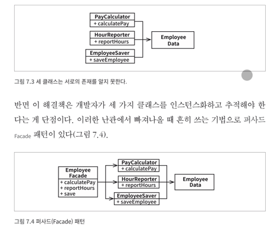
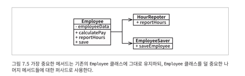
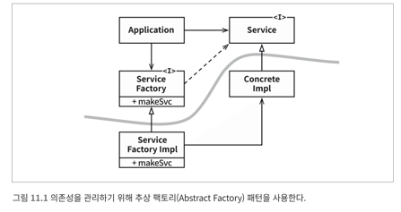

# 2. 벽돌부터 시작하기 : 프로그래밍 패러다임
## 3장. 패러다임의 개요 (ME)
1. 구조적 프로그래밍 
   - 제어흐름의 직접적인 전환에 대해 규칙을 부과한다.
2. 객체 지향 프로그래밍
   - 함수 포인터를 특정 규칙에 따라 사용하는 과정을 통해 필연적으로 다형성이 등장
   - 제어흐름의 간접적인 전환에 대해 규칙을 부과한다.
3. 함수형 프로그래밍
   - 수학적 문제를 해결하는 과정에서 람다 계산법 발명 이를 활용
   - 할당문에 규칙을 부과한다.

만약 두 숫자를 더하는 것을 각 패러다임으로 구현한다면
1. 구조적 프로그래밍 (Procedural Programming)
    ```c
    #include <stdio.h>
    int add_numbers(int x, int y) {
        return x + y;
    }
    void print_result(int result) {
        printf("The result is: %d\n", result);
    }
    int main() {
        int x = 5;
        int y = 10;
        int result = add_numbers(x, y);
        print_result(result);
        return 0;
    }
    ```
2. 객체 지향 프로그래밍 (Object-Oriented Programming)
    ```java
    public class Calculator {
        private int x;
        private int y;
    
        public Calculator(int x, int y) {
            this.x = x;
            this.y = y;
        }
    
        public int add() {
            return this.x + this.y;
        }
    
        public void printResult(int result) {
            System.out.println("The result is: " + result);
        }
    
        public static void main(String[] args) {
            Calculator calc = new Calculator(5, 10);
            calc.printResult(calc.add());
        }
    }
    ``` 
3. 함수형 프로그래밍 (Functional Programming) : 불변성 유지, 함수 조합을 강조   
예시 언어 : [Haskell](https://namu.wiki/w/Haskell)
    ```Haskell
    add :: Int -> Int -> Int
    add x y = x + y
    
    printResult :: Int -> IO ()
    printResult result = putStrLn ("The result is: " ++ show result)
    
    -- Main function
    main :: IO ()
    main = do
        let x = 5
        let y = 10
        let result = add x y
        printResult result
    ```


## 4장. 구조적 프로그래밍
데이크스트라가 초기에 인식한 문제는 프로그래밍은 어렵고, 프로그래머는 프로그래밍을 잘하지 못한다는 사실이었다.
데이크 스트라는 증명을 통해 수학적인 원리를 적용하여 이 문제를 해결하고자 했다.
모든 프로그램을 순차, 분기, 반복이라는 세가지 구조로 표현할 수 있다는 사실을 증명했다. 

순차 : 열거법을 이용해 입력, 출력을 수학적으로 추적 
분기 : 분기를 통한 각 경로를 열거 했다. 결과적으로 두 경로가 수학적으로 적절한 결과를 만들어 낸다
반복 : 귀납법과 열거법을 사용하여 해결하였다. 

하지만 이런 엄밀한 증명을 바탕으로 고품질의 소프트웨어를 생산하기 위한 적절한 방법이라고 믿는 사람은 없다.

테스트를 실패함으로써 올바름을 보여준다. 프로그램을 증명 가능한 세부 기능집합으로 재귀적으로 분해하고 테스트를 통해 증명 가능한 세부 기능들이 거짓인지를 증명하려 시도한다. 


## 5장. 객체 지향 프로그래밍
좋은 아키텍처를 만드는 일은 객체지향 OO 설계 원칙을 이해하고 응용하는 데서 출발한다.
실제 세계를 모델링 하는 새로운 방법 ( 너무 추상적 이다. )
OO의 본직을 설명하기 위해 캡슐화, 상속, 다형성에 의족하여 설명한다.

### 캡슐화
- 구분선 바깥에서 데이터는 은닉되고 일부 함수만이 외부에 노출된다. (private, public)
- c 언어에서는 특별한 방식(struct..)등 으로 이를 사용하고 이후에는 C++에서 OO를 지원한다. 
- 자바와 C#은 헤더와 구현체를 분리하는 방식을 모두 버렸고 이로 인해 캡슐화가 훼손 되었따. 
- 실제로 많은 OO언어가 캡슐화를 거의 강제하지 않는다. 
- OO프로그래밍은 프로그래머가 충분히 올바르게 행동함으로써 캡슐화된 데이터를 우회해서 사용하지 않을거라는 믿음을 기반으로 한다. 

### 상속
- 상속만큼은 OO언어가 확실히 제공했다.

### 다형성
- 의존성 역전
  - 다형성을 안전하고 편리하게 적용할 수 있는 기능
  - 시스템의 소스코드 의존성 전부에 대해 방향을 결정할 수 있는 절대적인 궈한을 갖는다
  - 즉, 소스코드 의존성이 제어프름의 방향과 일치되도록 제한하지 않는다.
  - 호출하는 모듈이든 아니면 호출받는 모듈이든 관계없이 소프트웨어 아키텍트는 소스코드 의존성을 워하는 방향으로 설정할 수 있다. 

### 결론 
- OO란 다형성을 이용하여 전체 시스템의 모든 소스코드 의존성에 대한 절대적인 제어 권한을 획득할 수 있는 능력이다. OO를 사용하면 아키텍트는 플러그인 아키텍처를 구성할 수 있고 이 통해 고수준의 정책을 포함하는 모듈은 저수준의 세부사항을 포함하는 모듈에 대해 독립성을 보장할 수 있다. 저수준의 세부사항은 중요도가 낮은 플러그인 모듈로 만들 수 있고, 고수준의 정책을 포함하는 모듈과는 독립적을 개발하고 배포할 수 있다. 

## 6장. 함수형 프로그래밍 
함수형 언어에서 변수는 변경되지 않는다. 

### 불변성과 아키텍처
아키텍처를 고려할 떄 변수의 가변성이 중요한 이유 -> 경합 조건, 교착상태조건, 동시 업데이트 문제가 모두 가변 변수로 인해 발생하기 때문이다. 
다수의 스레드와 프로세스를 사용하는 애플리케이션에서 마주치는 모든 문제는 가변변수가 없다면 생기지 않는다.

### 가변성의 분리 
현명한 아키텍트라면 가능한 한 많은 처리를 불변 컴포넌트로 옮겨야 하고 가변 컴포넌트에서는 가능한 한 많은 코드를 빼내야 한다. 

# 3. 설계 원칙
SOLID : 좋은 벽돌로 좋은 아키텍처를 정의하는 원칙 
- 목적
  1. 변경에 유연하다
  2. 이해하기 쉽다
  3. 많은 소프트웨어 시스템에 사용될 수 있는 컴포넌트의 기반이 된다. 

## 7장. SRP 단일 책임 원칙
SRP: 단일 책임 원칙Single Responsibility Principle콘웨이Conway 법칙에 따른 따름정리: 소프트웨어 시스템이 가질 수 있는 최적의 구조는 시스템을 만드는 조직의 사회적 구조에 커다란 영향을 받는다. 따라서 각 소프트웨어 모듈은 변경의 이유가 하나, 단 하나여야만 한다. 

단일 모듈의 변경의 이유가 하나, 오직 하나뿐이어야 한다. => 하나의 모듈은 하나의 오직 하나의 사용자 또는 이해관계자에 대해서만 책임져야 한다. => 하나의 모듈은 하나의, 오직 하나의 액터에 대해서만 책임져야한다.  

### 징후 1. 우발적 중봅 
서로다른 액터가 의존하는 코드를 분리하라
(각 다른 actor가 동일 클래스내의 별도의 메서드를 사용하면서 하나가 수정되어 영향도를 주는 상황)
### 징후 2. 병합 
병합이 발생할 메서드를 각기 다른 클래스로 이동시켜라  
하지만 만약 여러개로 나눠야 해서 난잡한 상황이라면 파사드 (Facade) 패턴이 있다.  
``` 
퍼사드 패턴(Facade Pattern)은 구조 패턴(Structural Pattern)의 한 종류로써, 
복잡한 서브 클래스들의 공통적인 기능을 정의하는 상위 수준의 인터페이스를 제공하는 패턴이다. 
```  
[참고 링크](https://velog.io/@bagt/Design-Pattern-Facade-Pattern-%ED%8D%BC%EC%82%AC%EB%93%9C-%ED%8C%A8%ED%84%B4)

  
혹은 덜 중요한 나머지 메서드들에 대한 파사드로 사용할 수도 있다.  
  

단일 책임 원칙은 메서드와 클래스 수준의 원칙이다. 컴포넌트 수준에서는 공통 폐쇄 원칙이 된다. 아키텍처 수준에서는 아키텍서 경계의 생성을 책임지는 변경의 축이된다. 


## 8장. OCP 개방-폐쇄 원칙 (ME)
OCP: 개방-폐쇄 원칙Open-Closed Principle1980년대에 버트란트 마이어Bertrand Meyer에 의해 유명해진 원칙이다. 기존 코드를 수정하기보다는 반드시 새로운 코드를 추가하는 방식으로 시스템 행위를 변경할 수 있도록 설계해야만 소프트웨어 시스템을 쉽게 변경할 수 있다는 것이 이 원칙의 요지다.
확장에는 열려있어야 하고 변경에는 닫혀 있어야한다. 개체의 행위는 확장할 수 있어야 하지만, 개체를 변경해서는 안된다. 

시스템의 아키텍처를 떠받치는 원동력 중 하나다. 

OCP의 목표는 시스템을 확장하기 쉬운 동시에 변경으로 인해서 시스템이 너무 많은 영향을 받지 않도록 하는 데 있다. 시스템을 컴포넌트 단위로 분리하고 저수준 컴포넌트에서 발생한 변경으로부터 고수준 컴포넌트를 보호할 수 있는 형태의 의존성 계층 구조가 만들어 지도록 해야 한다. 

- 개선 전 
    ```java 
    class ShapeDrawer {
        public void draw(Object shape) {
            if (shape instanceof Circle) {
                System.out.println("Drawing a circle");
            } else if (shape instanceof Rectangle) {
                System.out.println("Drawing a rectangle");
            }
            // 새로운 도형이 추가되면 여기에 또 다른 조건문을 추가해야 한다
        }
    }
    
    class Circle {}
    class Rectangle {}
    
    public class Main {
        public static void main(String[] args) {
            ShapeDrawer drawer = new ShapeDrawer();
            drawer.draw(new Circle());  
            drawer.draw(new Rectangle()); 
        }
    }
    ```
- 개선 후 
    ```java
    // Shape 인터페이스
    interface Shape {
        void draw();
    }
    
    // Circle 클래스
    class Circle implements Shape {
        @Override
        public void draw() {
            System.out.println("Drawing a circle");
        }
    }
    
    // Rectangle 클래스
    class Rectangle implements Shape {
        @Override
        public void draw() {
            System.out.println("Drawing a rectangle");
        }
    }
    
    // ShapeDrawer 클래스
    class ShapeDrawer {
        public void drawShape(Shape shape) {
            shape.draw();
        }
    }
    //도형 추가시 클래스만 추가하면 된다. 
  
    // Main 클래스
    public class Main {
        public static void main(String[] args) {
            ShapeDrawer drawer = new ShapeDrawer();
            
            Shape circle = new Circle();
            Shape rectangle = new Rectangle();
            
            drawer.drawShape(circle);    
            drawer.drawShape(rectangle); 
        }
    }
    ```
  
- OCP를 적용하기 위한 방법
  - 상속 (is-a) -> 상위 클래스가 바뀌면 변경점이 크다는 단점이 있다. ( 변경되지 않을 추상화 인터페이스에 의존하라 - DI )
  - [컴포지션 (has-a)](https://jangjjolkit.tistory.com/60) 
    - 복합 객체를 구성하는 개별적인 객체들을 모두 동일한 방법으로 다를 수 있게 한다.
    - 객체의 구조가 복잡할 때 유용하며, 객체 간의 결합도를 낮추어 유연성을 높일 수 있다. 또, 새로운 개별 객체나 복합 객체를 추가하더라도 클라이언트 코드를 수정할 필요가 없어 유지보수성이 좋다.
    ```
    결정 TIP! : Depends on the logical relation. It just needs to make sense.
    Example:
    Lets say you have Animal classes.
    So you have these classes: Animal, Dog, Cat , Leopard, Fur, Feet
    Cat and Dog IS A Animal.
    Leopard IS A Cat.
    Animal HAS A Fur, Feet.
    
    In a nutshell:
    IS A relationship means you inherit and extend the functionality of the base class.
    HAS A relationship means the class is using another class, so it has it as a member.
    ```
    [stackoverflow](https://stackoverflow.com/questions/6395366/how-to-decide-whether-use-is-a-or-has-a-relation)

- OCP를 따른 JDBC
  - 데이터 베이스 인터페이스 JDBC 
  - 여러 DB와의 연결을 제공한다. 

- 참고 : [참고](https://inpa.tistory.com/entry/OOP-%F0%9F%92%A0-%EC%95%84%EC%A3%BC-%EC%89%BD%EA%B2%8C-%EC%9D%B4%ED%95%B4%ED%95%98%EB%8A%94-OCP-%EA%B0%9C%EB%B0%A9-%ED%8F%90%EC%87%84-%EC%9B%90%EC%B9%99), 
[참고 2](https://dublin-java.tistory.com/48), 
[장쫄깃 기술블로그](https://jangjjolkit.tistory.com/60 ),[참고3](https://dev.to/bytehide/learn-open-closed-principle-in-c-examples-21pa)

## 9장. LSP 리스코프 치환 원칙
LSP: 리스코프 치환 원칙Liskov Substitution Principle1988년 바바라 리스코프Barbara Liskov가 정의한, 하위 타입subtype에 관한 유명한 원칙이다. 요약하면, 상호 대체 가능한 구성요소를 이용해 소프트웨어 시스템을 만들 수 있으려면, 이들 구성요소는 반드시 서로 치환 가능해야 한다는 계약을 반드시 지켜야 한다.
여기에서 필요한 것은 다음과 같은 치환substitution 원칙이다. S 타입의 객체 o1 각각에 대응하는 T 타입 객체 o2가 있고, T 타입을 이용해서 정의한 모든 프로그램 P에서 o2의 자리에 o1을 치환하더라도 P의 행위가 변하지 않는다면, S는 T의 하위 타입이다.

### 상속을 사용하도록 가이드 하기 
특정 개체의 두가지 하위타입은 모두 부모 클래스 타입을 치환할 수 있다. 
하지만 정사각형 문제와 같은 경우는 LSP를 위반하는 전형적인 문제로 유명하다. 
- 예시
    ```mermaid
    classDiagram
        class Rectangle {
            +setWidth
            +setHeight
        }
    
        class Square {
            +setSide
        }
    
        Rectangle <|-- Square
    ```

### LSP를 위배하는 사례
아키텍트는 버그로 부터 시스템을 격리 해야한다. 또한 REST 서비스들의 인터페이스가 서로 치환 가능하지 않다는 사실을 처리하는 중요하고 복잡한 매커니즘을 추가해야한다. 

### 결론 
LSP는 아키텍처 수준까지 확장할 수 있고, 반드시 확장해야함ㄴ 한다. 치환 가능성을 조금이라도 위배하면 시스템 아키텍처가 오염되어 상당향의 별도 메커니즘을 추가해야 할 수 있기 때문이다.


## 10장. ISP 인터페이스 분리 원칙
ISP: 인터페이스 분리 원칙Interface Segregation Principle이 원칙에 따르면 소프트웨어 설계자는 사용하지 않은 것에 의존하지 않아야 한다.
ISP를 사용하는 근복적인 동기는 잠재되어 있는 더 깊은 우려사항을 볼 수 있다.
- 예시
    ```mermaid
    classDiagram
        Database D <|-- Framework F
        Framework F <|-- System S
    ```
- 정리
  - 불필요한 짐을 실은 무언가에 의존하면 예상 치도 못한 문제에 빠진다는 사실이다. 

## 11장. DIP 의존성 역전 원칙  (ME)
DIP: 의존성 역전 원칙Dependency Inversion Principle고수준 정책을 구현하는 코드는 저수준 세부사항을 구현하는 코드에 절대로 의존해서는 안 된다. 대신 세부사항이 정책에 의존해야 한다.

유연성이 극대화된 시스템, 읜존성이 추상에 의존하며 구체에는 의존하지 않는 시스템이다. 
우리가 의존하지 않도록 피하고자 하는것은 변동성이 큰 구체적인 요소이다.
구체적인 요소를 개발중이기에 자주 변경될 수 밖에 없는 모듈들이다. 

### 안정된 추상화
실제로 뛰어난 소프트웨어 설게자와 아키텍트라면 인터페이스의 변동성을 낮추기 위해 애쓴다. 
- 변동성이 큰 구체 클래스를 참조하지 말라.
  - 대신 안정된 추상 인터페이스를 참조하라
  - 추상 팩토리를 사용하도록 강제한다.
- 변동성이 큰 구체 클래스로부터 파생하지 말라.
- 구체 함수를 오버라이드 하지 말라.
- 구체적이며 변동성이 크다면 절대 그 이름을 언급하지 말라. 

- 정리 
  - 구체적인 것들로 부터 추상적인 것들을 분리한다. 추상 컴포넌트와 구체 컴포넌트다.  
  - 제어흐름은 소스코드 의존성과는 정반대 방향으로 곡선을 가로지른다는 점에 주목하자.   
  - 소스코드 의존성은 제어 흐름과는 반대 방향으로 역전 된다. 이 원칙을 의존성 역전이라 한다. 
      
  
- 예시  
  - DIP는 스프링의 IOC 에서도 사용중임 
  - OCP는 DIP를 사용하여 인터페이스를 기반으로 설계하도록 하여 지켜지도록 할 수도 있음 
  - [참고](https://hstory0208.tistory.com/entry/Java-%EC%9D%98%EC%A1%B4%EC%84%B1-%EC%A3%BC%EC%9E%85DI%EC%9D%B4%EB%9E%80-OCP%EC%99%80-DIP%EB%A5%BC-%EC%A7%80%ED%82%A4%EA%B8%B0-%EC%9C%84%ED%95%9C-%EB%B0%A9%EB%B2%95)

- 개선 전 코드 
    ```java
    // EmailService 클래스
    class EmailService {
        public void sendEmail(String message, String recipient) {
            System.out.println("Sending email to " + recipient + ": " + message);
        }
    }
    
    // SMSService 클래스
    class SMSService {
        public void sendSMS(String message, String recipient) {
            System.out.println("Sending SMS to " + recipient + ": " + message);
        }
    }
    
    // Notification 클래스
    class Notification {
        private EmailService emailService; // DIP 위반: 구체적인 클래스에 의존
        private SMSService smsService;     // DIP 위반: 구체적인 클래스에 의존
    
        public Notification() {
            emailService = new EmailService();
            smsService = new SMSService();
        }
    
        public void notifyUser(String message, String recipient, String method) {
            if (method.equalsIgnoreCase("email")) {
                emailService.sendEmail(message, recipient);
            } else if (method.equalsIgnoreCase("sms")) {
                smsService.sendSMS(message, recipient);
            }
        }
    }
    
    // Main 클래스
    public class Main {
        public static void main(String[] args) {
            Notification notification = new Notification();
            notification.notifyUser("Hello via Email!", "user@example.com", "email");
            notification.notifyUser("Hello via SMS!", "123-456-7890", "sms");
        }
    }
    
    ```

- 개선 후 코드 
    ```java
    // MessageService 인터페이스
    interface MessageService {
        void sendMessage(String message, String recipient);
    }
    
    // EmailService 클래스
    class EmailService implements MessageService {
        @Override
        public void sendMessage(String message, String recipient) {
            System.out.println("Sending email to " + recipient + ": " + message);
        }
    }
    
    // SMSService 클래스
    class SMSService implements MessageService {
        @Override
        public void sendMessage(String message, String recipient) {
            System.out.println("Sending SMS to " + recipient + ": " + message);
        }
    }
    
    // Notification 클래스
    class Notification {
        private final MessageService messageService;
    
        // Dependency Injection을 통해 의존성 주입
        public Notification(MessageService messageService) {
            this.messageService = messageService;
        }
    
        public void notifyUser(String message, String recipient) {
            messageService.sendMessage(message, recipient);
        }
    }
    
    // Main 클래스
    public class Main {
        public static void main(String[] args) {
            // EmailService를 사용한 경우
            MessageService emailService = new EmailService();
            Notification emailNotification = new Notification(emailService);
            emailNotification.notifyUser("Hello via Email!", "user@example.com");
    
            // SMSService를 사용한 경우
            MessageService smsService = new SMSService();
            Notification smsNotification = new Notification(smsService);
            smsNotification.notifyUser("Hello via SMS!", "123-456-7890");
        }
    }
    ```
  - 개선 후의 class diagram
    ```mermaid
    classDiagram
    class EmailService {
    +sendEmail(message: String, recipient: String)
    }
    
        class SMSService {
            +sendSMS(message: String, recipient: String)
        }
    
        class Notification {
            -EmailService emailService
            -SMSService smsService
            +notifyUser(message: String, recipient: String, method: String)
        }
    
        Notification --> EmailService
    ```
