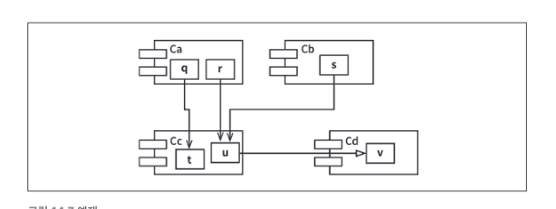

# 컴포넌트 원칙

## 12장. 컴포넌트

- 컴포넌트는 시스템의 구성 요소로 배포할 수 있는 가장 작은 단위이다.
- 자바로 치면 jar파일이 컴포넌트이다.
- 잘 설계된 컴포넌트라면 반드시 독립적으로 배포 가능한, 따라서 독립적으로 개발 가능한 능력을 갖춰야 한다.

### 재배치성
- 초기의 애플리케이션의 메모리는 크기가 매우 제한적이었기에 애플리케이션과 함수 라이브러리의 분리가 이루어졌다.
- 그러다보니 애플리케이션의 단편화가 지속되었고 크기가 커질수록 감당할 수 없게 되었다.


- 이를 해결하기 위해 지능적인 로더를 사용해서 메모리에 재배치할 수 있는 형태의 바이너리를 생성하도록 컴파일러를 수정하였다.
- 또한, 컴파일러는 재배치 가능한 바이너리 안의 함수 이름을 메타데이터 형태로 생성하도록 수정되었다.
- 컴파일러는 라이브러리 함수 이름을 외부 참조로 생성하고 라이브러리 함수를 정의하는 프로그램은 해당 이름을 외부 정의로 생성했다.
- 이렇게 함으로써 외부 정의를 로드할 위치가 정해지기만 하면 로더가 외부 참조를 외부 정의에 링크시킬 수 있게 되며 링킹 로더가 탄생했다.

### 링커
- 링킹 로더의 등장으로 프로그래머는 프로그램을 개별적으로 컴파일하고 로드할 수 있는 단위로 분할할 수 있게 되었다.
- 하지만 프로그램이 커지면서 링킹 로더가 프로그램을 로드하는 시간이 한 시간이 넘어가게 되었다.
- 이후 로드와 링크가 두 단계로 분리되었는데 프로그래머가 링크 과정을 맡고 링커라는 별도의 어플리케이션으로 링크 작업을 처리하게 되었다.
- 이후 고수준 언어로 넘어가면서 .jar 파일이 등장하였다.
- 다수의 jar파일 또는 공유 라이브러리를 순식간에 링크하고 링크가 끝난 프로그램을 실행하는 **컴포넌트 플로그인 아키텍쳐**가 탄생했다.


## 13장. 컴포넌트 응집도

### REP: 재사용/릴리스 등가 원칙
> 재사용 단위는 릴리스 단위와 같다.
- 소프트웨어 설계와 아키텍처 관점에서 보면 **"단일 컴포넌트는 응집성 높은 클래스와 모듈들로 구성되어야 함을 뜻한다."**
- 뒤죽박죽 임의로 선택된 클래스와 모듈로 구성되어서는 안되며 컴포넌트를 구성하는 모든 모듈은 서로 공유하는 중요한 테마나 목적이 있어야 한다.
- 하나의 컴포넌트로 묶인 클래스와 모듈은 반드시 함께 릴리스 할 수 있어야 한다.
- 하나의 컴포넌트로 묶인 클래스와 모듈은 버전 번호가 같아야 하며, 동일한ㄴ 릴리스로 추적 관리되고 동일한 릴리스 문서에 포함되어야 한다.

### CCP: 공통 폐쇄 원칙
> 동일한 이유로 동일한 시점에 변경되는 클래스를 같은 컴포넌트로 묶어라.
> 
> 서로 다른 시점에 다른 이유로 변경되는 클래스는 다른 컴포넌트로 묶어라.
- 이 원칙은 SRP를 컴포넌트 관점에서 다시 쓴 것이다.
- SRP는 클래스나 모듈의 응집도를 높이는 원칙이고, CCP는 컴포넌트의 응집도를 높이는 원칙이다.
- 대다수의 어플리케이션에서 유지보수성은 재사용성보다 훨씬 중요하다.
- 변경은 여러 컴포넌트에 분산되기 보다는 단일 컴포넌트로 제한하는 것이 좋고 해당 컴포넌트만 재배포하면 된다.
- 따라서 물리적, 개념적으로 강하게 결합되어 항상 함께 변경되는 클래스들은 하나의 컴포넌트에 속해야 한다.
- CCP는 OCP와도 밀접하게 관련되어 있는데 개방폐쇄원칙 에서는 클래스가 변경에는 닫혀있고 확장에는 열려있어야 한다.
CCP에서는 발생할 가능성이 있거나 과거에 발생했던 대다수의 공통적인 변경에 대해서 클래스가 닫혀 있도록 설계한다.
- 동일한 유형의 변경에 대해 닫혀 있는 클래스들을 하나의 컴포넌트로 묶음으로써 OCP에서 얻은 교훈을 확대 적용한다.

### CRP: 공통 재사용 원칙
> 컴포넌트 사용자들을 필요하지 않는 것에 의존하게 강요하지 말라.
- 함께 재사용되는 경향이 있는 클래스와 모듈들은 같은 컴포넌트에 포함해야 한다.
- 개별 클래스가 단독으로 재사용되는 경유는 거의 없다. 대체로 재사용 가능한 클래스는 재사용 모듈의 일부로써 해당 모듈의 다른 클랫스와 상호작용하는 경우가 많다.
- CRP는 각 컴포넌트에 어떤 클래스들을 포함시켜야 하는지 설명한다.
- 또한, 동일한 컴포넌트로 묶어서는 안되는 클래스가 무엇인지도 설명한다.
- 하나의 컴포넌트가 다른 컴포넌트의 단 한개의 클래스만 사용하더라도 수십개의 클래스를 사용할때와 의존성은 같다.
- 이러한 의존성은 사용되는 컴포넌트에서 발생한 변경이 사용하는 컴포넌트와는 무관한 경우에도 재컴파일, 재검증, 재배포를 해야 하는 가능성을 만든다.
- CRP는 ISP의 포괄적인 버전이다.
- ISP는 사용하지 않는 메서$드가 있는 클래스에 의존하지 말도록 하고 CRP는 사용하지 않는 클래스를 가진 컴포넌트에 의존하지 않도록 한다.

### 컴포넌트 응집도에 대한 균형 다이어그램


- REP와 CCP는 컴포넌트를 더욱 크게 많든다.
- CRP는 컴포넌트를 작게 만든다.
- 이 세가지 원칙을 균형 있게 적용하여 컴포넌트를 설계해야 한다.
- 일반적으로 프로젝트는 삼각형의 오른쪽에서 시작하며 프로젝트가 성숙하고 그 프로젝트로부터 파생된 또 다른 프로젝트가 시작되면
프로젝트는 삼각형에서 점차 왼쪽으로 이동한다. 즉, 컴포넌트 구조는 시간과 성숙도에 따라 변화한다.

## 14장. 컴포넌트 결합

### ADP: 의존성 비순환 원칙
> 컴포넌트 의존성 그래프에 순환이 있어서는 안된다.

#### 주 단위 빌드
- 주 단위 빌드는 중간 규모의 프로젝트에서는 흔하게 사용된다.
- 프로젝트 규모가 작을 때는 효과적이지만 규모가 커지면 통합하는데에 시간이 오래 걸려 효율성이 떨어진다.

### 순환 의존성 제거하기
- 위의 문제의 해결책은 개발 환경을 릴리스 가능한 컴포넌트 단위로 분리하여 개별 개발자 또는 단일 개발팀이 책임질 수 있는 단위를 부여하는 것이다.
- 이를 통해 특정 시점에 모든 개발자가 한데 모여서 진행중인 작업을 모두 통합하는 일을 없애고 작고 점진적인 통합을 이루어낸다.
- 이 절차가 성공적으로 동작하기 위해서는 반드시 순환 의존성을 제거해야 한다.


- 이러한 구조에서 한 가지 더 주목할 점은, 어느 컴포넌트에서 시작하더라도 의존성 관계를 따라가다보면 최초의 컴포넌트로 돌아갈 수 없다는 것이다.
- 시스템 전체를 릴리스해야 할 떄가 모면, 릴리스 절차는 상향식으로 가장 아래인 Entities부터 진행된다.

### 순환이 컴포넌트 의존성 그래프에 미치는 영향
- 만약 Entities에 포함된 클래스가 Authorizer에 의존하게 된다면 순환 의존성이 발생한다.
- 이렇게 되면 여러 클래스 중 하나에 간단한 단위 테스트를 실행하는데 에러가 많이 발생한다.

### 순환 끊기
- 컴포넌트 사이에 순환을 끊고 의존성을 다시 DAG로 원상복구하는 일은 언제라도 가능하다.
- 첫 번째 방법은 의존성 역전 원칙을 적용하는 것이다. User가 필요로 하는 메서드를 제공하는 인터페이스를 생성하여 Entities에 위치시키고 Authorizer는 이 인터페이스를 상속받는다.
이런 방식으로 Entities와 Authorizer 사이의 의존성을 역전시킬 수 있으며 순환을 제거할 수 있다.


- 두 번째 방법은 Entities와 Authorizer가 모두 의존하는 새로운 컴포넌트를 만드는 것이다.
- 그리고 두 컴포넌트가 모두 의존하는 클래스들을 새로운 컴포넌트로 이동시킨다.


### 흐트러짐(Jitters)
- 두 번째 해결방법이 시사하는 바는 요구사항이 변경되면 컴포넌트 구조도 변경될 수 있다는 것이다.
- 실제로 애플리케이션이 성장함에 따라 의존성 구조는 서서히 흐트러지며 또 성장한다.
- 따라서 항상 이를 관찰하고 적절한 조치를 취해야 한다.

### 하향식(Top-Down) 설계
- 위의 내용들로 알 수 있는 것은, 컴포넌트는 시스템에서 가장 먼저 설계할 수 있는 대상이 아니며 오히려 시스템이 성장하고 변경될 떄 함께 진화는 대상이라는 것이다.
- 즉, 컴포넌트 구조를 하향식으로 설계될 수 없다.
- 컴포넌트 의존성 다이어그램은 애플리케이션의 기능을 기술하는 일과는 거의 관련이 없으며 빌드 가능성, 유지보수성을 보여주는 Map이다.
- 이러한 이유 때문에 컴포넌트 구조는 프로젝트 초기에 설계할 수 없다.
- 하지만 구현과 설계가 이루어지는 프로젝트 초기에 모듈들이 점차 쌓인다면 여러 원칙을 적용하게 된다.
- 결국 컴포넌트 의존성 그래프는 자주 변경되는 컴포넌트로부터 안정적이며 가치가 높은 컴포넌트를 보호하려는 아키텍트가 만들고 가다듬게 된다.

### SDP(Stable Dependencies Principle) : 안정된 의존성 원칙

> 안정성의 방향(더 안정된 쪽)으로 의존하라.

- 설계는 결코 정적일 수 없으며 공통 폐쇄 원칙을 준수함으로써 변동성을 줄이고 안정성을 높일 수는 있다.
- 변경하기 어려운 모듈이 변경하기 쉽게 만들어진 모듈에 의존하지 않도록 만들어야 한다.

### 안정성
- 소프트웨어 컴포넌트를 변경하기 어렵게 만드는 방법은 다양한 컴포넌트가 의존하게 만드는 것이다.
- 사소한 변경이라도 의존하는 모든 컴포넌트를 만족시키면서 변경을 적용해야 하기 떄문에 변경이 어려워 안정적이라고 볼 수 있다.

### 안정성 지표
- 컴포넌트의 안정성을 측정하는 방법으로 컴포넌트로 들어오고 나가는 의존성의 개수를 세어 보는 방법이 있다.
  - `Fan-in` : 컴포넌트 안으로 들어오는 의존성. 컴포넌트 내부 클래스에 의존하는 컴포넌트 외부 클래스의 개수
  - `Fan-out` : 컴포넌트 밖으로 나가는 의존성. 컴포넌트 내부 클래스가 의존하는 외부 클래스의 개수
  - `I` : 안정성 지표. Fan-out / (Fan-in + Fan-out), I=0이면 최고로 안정된 컴포넌트이며 I=1이면 최고로 불안정한 컴포넌트이다.


- Cc 컴포넌트의 I는 1/4이다.
- SDP에서 컴포넌트의 I 지표는 그 컴포넌트가 의존하는 다르 컴포넌트들의 I보다 커야 한다.
- 즉, 의존성 방향으로 갈수록 I 지표값이 감소해야 한다.

### 모든 컴포넌트가 안정적이어야 하는 것은 아니다.
- 모든 컴포넌트가 최고로 안정적인 시스템은 변경이 불가능하다.
- 이상적인 구조는 불안정한 컴포넌트와 안정된 컴포넌트가 모두 존재하는 상태이다.


- 다이어그램에서 불안정한 컴포넌트를 관례적으로 위쪽에 두는데 이 관례를 따르면 화살표가 위로 향할 시 SDP를 위배하는 상태로 알 수 있어 유용하다.
- Flexible은 변경하기 쉽도록 설계된 컴포넌트인데 Stable의 I가 Flexible의 I보다 작음에도 불구하고 Flexible이 Stable에 의존하고 있기에 SDP를 위배한다.
- 이를 해결하기 위해서는 의존성을 제거해야 하는데 DIP를 도입하면 해결할 수 있다.


- 이렇게 하면 의존성을 제거하고 UServer는 매우 안정된 상태를 가지며 Flexible은 I=1을 유지할 수 있다.
- 또한, 모든 의존성은 I가 감소하는 방향으로 향한다.

---
### <div style= "background-color : yellow"> 추가사항 </div>
> #### 안정된 의존 관계 원칙 (SDP)
>
> 쉽게 바뀔 수 있는 모둘에 무언가가 의존하기 시작하면 해당 모듈은 변경하기 어려워진다.
> 
> 안정된 의존관계 원칙(SDP)에 따르면 어떤 패키지의 불안정성 측정값은 그 패키지가 의존하는 다른 패키지들의 불안정성 값들보다 반드시 커야 한다.
> 
> #### Controller - Service - Repository
> 
> Controller는 일반적으로 Service와 Repository에 의존하는데 이 때 Controller의 안정성(불안정성)은 1로서 최고로 불안정하다.
> 
> Service는 Repository에 의존하며 Controller의 의존대상이 되는데 Service의 안정성은 0.333 정도로 약간 안정적이다.
> 
> Repository는 Service가 의존하는 대상이 되며 불안정성이 0으로 최고로 안정적이다.
> 
> 따라서 의존관계는 Controller (1) -> Service (0.333) -> Repository (0)으로 의존성이 감소하는 방향으로 향해야 한다.
> 
> 하지만 이러한 안정적인 설계는 유연성이 떨어지게 된다. 안정적이면서도 설계의 유연성을 높일 수 있는 방법이 있는데 바로 추상 클래스(Abstract class)이다.
------

### SAP: 안정된 추상화 원칙
> 컴포넌트는 안정된 정도만큼만 추상화되어야 한다.

- 시스템에서 자주 변경해서는 안되는 내용은 반드시 안정된 컴포넌트로 캡슐화해야 한다.
- 하지만 고수준 정책을 안정된 컴포넌트에 위치시키면 그 정책을 포함하는 소스 코드는 수정하기 어려워진다.
- 컴포넌트가 최고로 안정된 상태이면서도 동시에 변경에 충분히 대응할 수 있을 정보로 유연하게 만들기 위해서는 OCP(개방 폐쇄 원착)을 적용해야 한다.
- OCP는 클래스를 수정하지 않고도 충분히 변경할 수 있도록 유연하게 하는데 이 원칙을 준수하는 클래스가 바로 `추상 클래스`이다.

### 안정된 추상화 원칙
- 안정된 추상화 원칙은 안정성과 추상화 정도 사이의 관계를 정의한다. 
    1. 안정된 컴포넌트는 추상 컴포넌트여야 하며, 안정성이 컴포넌트를 확장하는 일을 방해해서는 안 된다고 한다.
    2. 불안정한 컴포넌트는 반드시 구체 컴포넌트여야 한다고 하는데 컴포넌트가 불안정하므로 컴포넌트 내부의 구체적인 코드를 쉽게 변경할 수 있어야 하기 떄문이다.
- 따라서 안정적인 컴포넌트라면 반드시 인터페이스와 추상 클래스로 구성되어 쉽게 확장할 수 있어야 한다.
- SAP와 SDP를 결합하면 컴포넌트에 대한 DIP나 마찬가지가 된다.

### 추상화 정도 측정하기
- A 지표는 컴포넌트 추상화 정도를 측정한 값이며 컴포넌트 클래스 총 수 대비 인터페이스와 추상 클래스의 개수를 단순히 계산한 값이다.
  - `Nc` : 컴포넌트 클래스의 개수
  - `Na` : 추상 클래스와 인터페이스의 개수
  - `A = Na / Nc`
- A 지표는 0과 1 사이의 값을 가지며, 1에 가까울수록 컴포넌트가 추상화되어 있음을 의미한다.

### 주계열
- 안정성(I)와 추상화정도(A) 사이의 관계를 정의하자면 아래와 같다.


- 모든 컴포넌트가 (0,1) 또는 (1,0)에 위치할 수 없으므로 그래프 상에 컴포넌트가 위치할 수 있는 합리적인 점의 궤적을 가정할 수 있는데
이 궤적은 컴포넌트가 절대 위치해서는 안되는 영역 즉, 배제구역이다.

### 고통의 구역
- (0,0) 주변 구역에 위치한 컴포넌트들은 매우 안정적이며 구체적이지만 추상적이지 않기에 확장할 수 없어 유연하지 못하다.
- 하지만 일부 소프트웨어 엔티티 예를 들어, 데이터베이스 스키마는 고통의 구역에 위치하기도 한다.
- 고통의 구역 안에서 변동 가능성이 없는 컴포넌트는 해롭지 않으나 고통의 구역에서 변동성이 큰 컴포넌트는 문제가 된다.

### 쓸모없는 구역
- (1,1) 주변 구역에 위치한 컴포넌트들은 매우 추상적이지만 누구도 그 컴포넌트에 의존하지 않기에 쓸모가 없다.

### 배제 구역 벗어나기
- 배제 구역을 벗어나기 위해서는 변동성이 큰 컴포넌트 대부분은 두 배제 구역으로부터 멀리 떨어뜨려야 한다.
- 각 배제 구역으로부터 최대한 멀리 떨어진 점의 궤적은 (1,0)과 (0,1)을 잇는 선분이며 이 선분을 "주계열"이라고 한다.
- 컴포넌트가 위치할 수 있는 가장 바람직한 지점은 주계열의 두 종점이다.

### 주계열과의 거리
- 컴포넌트가 주게열과 얼마나 가까운지를 측정하는 지표가 있다.
  - `D` : 주계열과의 거리. |I + A - 1|, D가 0이면 컴포넌트가 주계열 바로 위에 위치하고 1이면 가장 멀리 위치한다.
- 이 지표를 계산함으로써 컴포넌트가 주게열에 대체로 일치하도록 설계되었는지 분석할 수 있고 설계를 통계적으로 분석할 수 있다.


- 그림처럼 컴포넌트 산점도를 통해 표준편차 영역을 벗어나는 일부 컴포넌트를 발견하고 재검토할 수 있다.
- D지표를 활용하는 또 다른 방법으로, 각 컴포넌트의 D 값을 시간에 따라 그려볼 수 있다.


- 컴포넌트가 주계열에서 벗어나는 원인을 조사해볼 수 있다.

---
### <div style= "background-color : yellow"> 추가사항 </div>
> #### 안정된 추상화 원칙 (SAP)
> 
> 안정된 추상화 원칙은 안정적인 패키지는 그 안정성 떄문에 확장이 불가능하지 않도록 추상적이기도 해야하며,
> 거꾸로 이 원칙에 따르면 불안정한 패키지는 구체적이어야 하는데, 그 불안정성이 그 패키지 안의 구체적인 코드가 쉽게 변경될 수 있도록 허용하기 때문이다.
> 
> 따라서 어떤 패키지가 안정적이라면 확장할 수 있도록 추상 클래스들로 구성되어야 하며, 확장이 가능한 안정적인
> 패키지는 유연하며 따라서 설계를 지나치게 제약하지 않아야 한다.
> 1. Controller는 불안정하므로 추상적일 필요가 없다. -> Controller 클래스 Interface를 만들고 구현하는 것은 의미가 없다.
> 2. Repository는 매우 안정적이므로 추상적이어야 한다. -> Repository는 Interface를 만들고 구현하는 것이 좋다.
> 
> #### 고통의 지역 에시
> 1. DB 스키마
>   - 데이터 베이스 스키마는 매우 구체적인데 이에 의존하는 코드도 많은 안정적인 코드이다.
>   - 따라서 DB 스키마 변경은 매우 고통스럽다.
> 2. String 관련 클래스
>   - String 관련 클래스들은 매우 안정적으로 다른 수많은 코드가 의존하고 있지만 매우 구체적인 코드이다.
>   - 하지만 문자열 코드는 변경 가능성이 매우 적어 해가 되지 않는다.
> 
> #### 쓸모없는 지역 예시
> 1. Controller
>    - Contoller는 추상성이 0, 불안정성이 1로 주계열 그래프의 (0,1)에 위치하는데 이를 추상화한다면 (1,1)이 되어 쓸모없는 지역에 위치하게 된다.
>    - 따라서 controller는 추상화할 필요가 없다.
> 2. Spring Batch - Tasklet
> ```java
> // Spring Batch 설정
> @Configuration
> @EnableBatchProcessing
> public class BatchConfig {
> 
> private final JobBuilderFactory jobBuilderFactory;
> private final StepBuilderFactory stepBuilderFactory;
> 
>     public BatchConfig(JobBuilderFactory jobBuilderFactory, StepBuilderFactory stepBuilderFactory) {
>         this.jobBuilderFactory = jobBuilderFactory;
>         this.stepBuilderFactory = stepBuilderFactory;
>     }
> 
>     @Bean
>     public Job exampleJob() {
>         return jobBuilderFactory.get("exampleJob")
>                 .incrementer(new RunIdIncrementer()) // Job 실행 시마다 새로운 ID를 부여
>                 .start(exampleStep()) // Job 실행 시 첫 번째 Step
>                 .build();
>     }
> 
>     @Bean
>     public Step exampleStep() {
>         return stepBuilderFactory.get("exampleStep")
>                 .tasklet(exampleTasklet()) // Step 실행 시 Tasklet을 실행
>                 .build();
>     }
> 
>     @Bean
>     public Tasklet exampleTasklet() {
>         return (contribution, chunkContext) -> {
>             // 여기서 실제 비즈니스 로직을 구현합니다.
>             System.out.println("Executing Tasklet...");
>             // 예시 비즈니스 로직
>             return RepeatStatus.FINISHED; // Tasklet이 성공적으로 완료됨을 나타냄
>         };
>     }
> }
> 
> // 애플리케이션 실행 클래스
> @SpringBootApplication
> public class BatchApplication {
> 
>     public static void main(String[] args) {
>         SpringApplication.run(BatchApplication.class, args);
>    }
> }
> ```
>    - Tasklet은 Spring Batch에서 사용되는 일종의 작업 단위로 특정 작업을 수행하는 코드이며 개발자가 직접 호출하지 않기 때문에 추가적인 추상화를 위한 인터페이스는 필요가 없다.
>    - 단순히 Spring Framework가 Tasklet이라는 작업 단위를 인식할 수 있도록 Spring Batch에서 제공하는 것이다.
>    - 개발자가 직접 사용하는 코드가 아닌 프레임워크에 의헤 호출되는 코드는 프레임워크 규약을 따르기 위한 인터페이스를 제외하고는 별도 인터페이스를 추가하여 구현할 필요가 없다.
>    - +) exampleTasklet 메서드는 Tasklet 인터페이스를 구현하여 리턴한다. 이 때, 비즈니스 로직이 포함된 execute 메서드를 정의한다.
>
> #### Service 추상화에 대하여
> - Controller는 불안정성이 1로 매우 불안정하며 추상화가 필요하지 않고 Repository는 안정성이 0으로 매우 안정적이며 추상화가 필요하다.
> - Service는 Controller와 Repository 사이에 위치하여 상황에 따라 추상화 여부를 결정해야 한다.
> 
> #### EmailService 예시
> - 웹서비스를 만들면 대체로 Email 발송 기능을 포함하게 되는데 이 기능은 SMTP서버, 배치작업, MQ 등 여러 방법으로 구현이 가능한 변동성이 큰 기능이다.
> - SMTP서버를 사용하고 100개의 EmailService 호출이 있다고 가정할 때, EmailService의 불안정성은 (패키지 외부 의존 (1) / (패키지에 의존하는 외부 클래스 (100개) + 패키지 외부 의존 (1)) = 0.009)로 매우 안정적이다.
> - 하지만 만약 추상성이 0이라면 즉, 추상화가 이루어지지 않는다면 주계열로부터의 거리 = |0 + 0.009 - 1| = 0.991로 매우 먼 거리에 위치하게 된다.
> - 따라서 EmailService는 추상화가 필요하다.
> - 만약 추상화를 진행하면 주계열로부터의 거리가 0.009가 되어 훌륭한 설계가 이루어질 수 있다.
> 
> #### 추상 클래스
> - 추상성을 높이기 위해 추상 클래스를 사용할 수 있다.
>   - 추상 클래스는 클래스 자체가 인스턴스화 될 수 없는 클래스이다.
>   
>   >   #### +) 추상 클래스 vs 인터페이스
>   >   1. 다중 상속:
>   >      - 인터페이스: 다중 상속이 가능합니다. 클래스는 여러 개의 인터페이스를 구현할 수 있습니다.
>   >      - 추상 클래스: 단일 상속만 가능합니다. 추상 클래스는 오직 하나의 부모 클래스만 가질 수 있습니다.
>   >   
>   >   2. 목적 및 사용 사례:
>   >      - 인터페이스: 특정 행동이나 역할을 정의하는 계약(Contract)입니다. 클래스가 특정 인터페이스를 구현함으로써 해당 행동을 수행할 수 있음을 보장합니다.
>   >      - 추상 클래스: 공통된 상태(필드) 및 행동(메서드)를 공유하여 코드 재사용성을 높이는 데 사용됩니다. 또한 다른 클래스가 이를 상속하여 구체적인 구현을 제공할 수 있습니다.
>   > 
>   >   3. 상태(필드):
>   >      - 인터페이스: 상수를 제외하고 필드를 가질 수 없습니다. 모든 필드는 암묵적으로 public static final입니다.
>   >      - 추상 클래스: 인스턴스 필드를 가질 수 있으며, 이를 통해 상태를 유지할 수 있습니다.
>   > 
>   >   4. 접근 제어자:
>   >      - 인터페이스: 기본적으로 모든 메서드는 public입니다. Java 9부터 private 메서드를 가질 수 있습니다.
>   >      - 추상 클래스: 모든 접근 제어자를 사용할 수 있습니다 (public, protected, default, private).
>   > 
>   >   5. 메서드 구현:
>   >      - 인터페이스: Java 8부터 디폴트 메서드와 정적 메서드를 통해 구현된 메서드를 가질 수 있습니다.
>   >      - 추상 클래스: 구현된 메서드와 추상 메서드를 가질 수 있습니다.
> 
> - 추상성을 높이기 위해 추상 클래스를 이용할 때는 규칙이 하나 더 필요하다.
> - "Interface의 메서드 시그니처(파라미터)에 구현에 대한 정보가 없어야 한다."
> ```java
> boolean sendEmail(String smtpHost, String username, String password,
>             String senderEmail, List<String> receiverEmail, String subject, String content);
> ```
> - 위의 sendEmail 메서드의 시그니처에 String smtpHost, Username, Password가 포함되어 있는데 이 파라미터들은 Eamil 발송을 SMTP로 구현한다고 가정할 때만 의미가 있는 값들이다.
> - 즉, 인터페이스에서 그 구현이 SMTP 서버를 통해 이루어져야 한다고 제약을 걸고 있는 것이다.
> - 이러한 경우 추상 클래스를 통해 추상성을 높이더라도 확장에 유연하지 못하기 때문에 인터페이스의 메서드 시그니처에는 구현의 상세에 대한 정보를 가지고 있어서는 안된다.
> ```java
> boolean sendEmail(String senderEmail, List<String> receiverEmail, String subject, String content);
> ```
> <br>
> 
> ---
> 
> 참고자료 
> - https://techblog.woowahan.com/2561/
------


