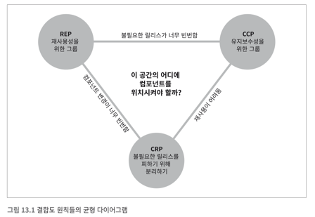
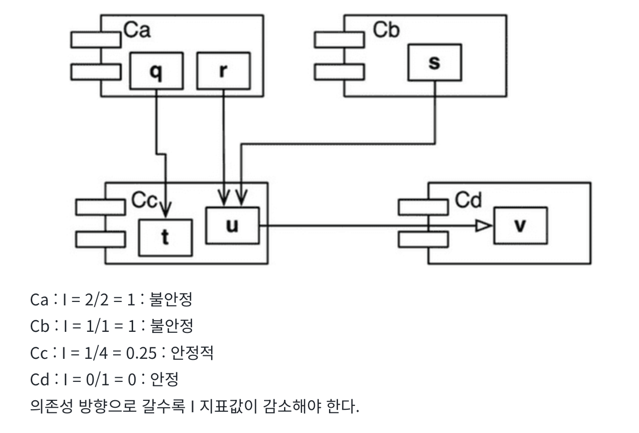
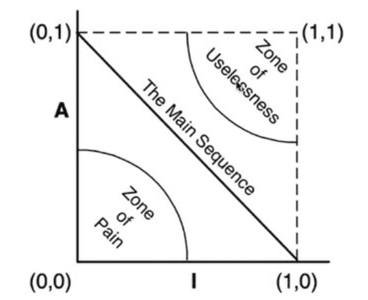

# 4장 : 컴포넌트 원치

## 12장. 컴포넌트

컴포넌트 : 배포단위 (자바: jar, 루비: gem ..)
잘 설계된 컴포넌트라면 반드시 독립적으로 배포 가능한, 따라서 독립적으로 개발 가능한 능력을 갖춰야 한다.

- 컴포넌트의 간략한 역사
    - 소프트웨어 개발 초창기에는 프로그램이 로드될 위치 부터 설정하는 것이 중요한 결정사항중 하나였다.(당시 시대에는 한정적 자원이었다.)
    - 프로그래머가 라이브러리 함수의 소스코드를 애플리케이션 코드에 직접 포함시켜 단일 프로그램으로 컴파일 했다. 라이브러리는 바이너리가 아닌 소스 코드 형태로 유지되었다. 컴파일러는 소스코드 전체를 여러번에
      걸쳐서 읽어야 했고 오래걸렸다.
    - 시간 단축을 위해 소스코드를 애플리케이션 코드로 부터 분리했다. (일부 범위는 애플리케이션 로드, 아래 라이브러리 메모리 로드)
    - 하지만 애플리케이션이 커지면서 두개의 주소 세그먼트로 분리하여 함수 라이브러리 공간을 사이에 두고 오가며 동작하게 배치해야 한다. (지속 가능하지 않다.)
- 재 배치성
    - 이를 해결하기 위해 재 배치가 가능한 바이너리를 사용했다.
    - 지능적인 로더를 사용하여 메모리를 재배치 가능하도록 하였다. 재배치 코드에는 로드한 데이터에서 어느 부분을 수정해야 정해진 주소에 로드할 수 있는지 알려주는 플래그가 삽입되었다.
    - 이제 프로그래머가 함수 라이브러리를 로드할 위치와 애플리케이션을 로드할 위치를 로더에게 지시할 수 있게 되었다.
    - 링킹 로더 : 컴파일러가 메타데이터로 바이너리안의 함수이름을 저장, 라이브러리 함수 이름을 외부 참조로 생성, 라이브러리 함수를 정의하는 프로그램이면 외부 정의로 생성 (외부 정의를 로드할 위치가 정해지면
      외부 참조를 외부정의에 링크 시킬 수 있게 되었다 )
- 링커
    - 링킹노드가 느린 문제점을 로드와 링크 두 단계로 분리하였다.
    - 프로그래머가 링크과정을 맡았다. ( 링커라는 별도의 APP을 만들어 처리, 링크가 완료된 재배치 코드를 만들어줌 )
    - " 컴파일 하고 링크하는 데 사용 가능한 시간을 모두 소모할 때까지 프로그램은 커진다."
    - 하지만 컴퓨터의 속도가 빨라지고 메모리가 커져서 이를 해결하였다.
    - 이제는 링킹과 로드를 동시에 할 수 있게 되었다. ( 컴포넌트 플러그인 아키텍처의 탄생, 오늘날 .jar, DLL, 공유 라이브러리를 기존 애플리케이션에 플러그인 형태로 배포하는 것이 일상적인 일이
      되었다. )

? 질문 : 컴포넌트 플러그인 아키텍처는 링킹과 로드를 동시에할 수 있는
것? => [참고](https://f-lab.kr/insight/understanding-component-based-architecture), [책의 내용이 여기에](https://wikidocs.net/167373)

## 13장. 컴포넌트 응집도 (ME)

- 컴포넌트 응지도와 관련된 세 가지 원칙을 논의 한다.
    - REP: 재사용/릴리스 등가 원칙 (Reuse/Release Equivalence Principle)
    - CCP: 공통 폐쇄 원칙 (Common Closure Principle)
    - CRP: 공통 재사용 원칙 (Common Reuse Principle)

### REP: 재사용/릴리스 등가 원칙 (Reuse/Release Equivalence Principle)

- 재사용 단위는 릴리즈 단위와 같다. (릴리즈 노트를 작성하자)
- 지난 십 년은 maven, leiengen, rvm과 같은 모듈 관리 도구가 많이 등장하였다.
- 새로운 버전이 나온다는 소식을 접하면 개발자는 새 릴리즈 변경사항을 살펴보고 기존버전을 계속 사용할지등을 결정한다.
- 응집성 높은 클래스와 모듈들로 구성되어야 한다. 단순히 뒤죽박준 임의로 선택된 클래스와 모듈들로 구성되어야 한다.
- 하나의 컴포넌트로 묶인 클래스와 모듈은 버전 번호가 같아야 하며, 동일한 릴리즈로 추적 관리되어야 한다.
- 이 원칙을 어긴다면 컴포넌트 사용자가 알게되고 아키텍트로서의 능력을 높게 평하지 않은 것이다.
- 해당 원칙의 약점 CCP, CRP에 의해 보완할 수 있다

### CCP: 공통 폐쇄 원칙 (Common Closure Principle)

- 동일한 이유로 동일한 시점에 변경되는 클래스를 같은 컴포넌트로 묶어라. 서로 다른 시점에 다른 이유로 변경되는 클래스는 다른 컴포넌트로 분리하라.
- 단일 책임원칙 ( SRP )의 컴포넌트 관점
    - SRP에서는 변경되는 메서드를 서로 다른 클래스로 분리하라한다.
    - CCP에서는 서로 다른 이유로 변경되는 클래스를 서로 다른 컴포넌트로 분리하라 한다.
    - 즉, **동일한 시점에 동일한 이유로 변경되는 것들을 한데 묶어라. 서로 다른 시점에 다른 이유로 변경되는 것들은 서로 분리하라.**
- 유지보수성 > 재사용성
- 변경 가능성이 있는 컴포넌트들끼리 묶어라
- 개방 폐쇄 원칙( OCP) 와도 관련이 있다. 폐쇄의 의미가 동일하다.
- 발생할 가능성이 있거나 과거에 발생했던 대다수의 공통적인 변경에 대해서 클래스가 닫혀 있도록 설계한다.

### CRP: 공통 재사용 원칙 (Common Reuse Principle)

- 컴포넌트 사용자들을 필요하지 않는 것에 의존하게 강요하지 말라.
- 클래스와 모듈을 어느 컴포넌트에 위치시킬지 결정할때 도움되는 원칙이다. 같이 재사용 되는 경향이 있는 클래스와 모듈들은 같은 컴포넌트에 포함해야 한다고 말한다.
- 각 컴포넌트에 어떤 클래스들을 포함시켜야 하는지를 설명해준다.
- 의존하는 컴포넌트가 있다면 모든 클래스에 대해 의존함을 확실히 인지해야한다.
- 너무 작게 분리하면 필요이상으로 많은 컴포넌트를 재배포 하느라 노력을 허비한다.
- CRP는 어떤 클래스를 한데 묶어서는 안 되는지에 대해서 훨씬 더 많은 것을 이야기한다. CRP는 강하게 결합되지 않은 클래스들은 동일한 컴포넌트에 위치시켜서는 안된다고 말한다.
- ISP와의 관계
    - CRP는 인터페이스 분리원칙의 포괄적인 버전이다. ISP는 사용하지 않은 메서드가 있는 클래스에 의존하지 말라고 조언한다. CRP는 사용하지 않는 클래스를 가진 컴포넌트에 의존하지 말라고 존언한다.
    - **필요하지 않은 것이 의존하지 말라**

### 컴포넌트 응집도에 대한 균형 다이어그램

- 포함 원칙 : REP, CCP , 컴포넌트를 더 크게 만든다.
- 배제 원칙 : CRP , 컴포넌트를 작게 만든다.
- REP와 CRP에 중점을 두면 사소한 변경시 너무 많은 컴포넌트에 영향을 미친다.
- CCP와 REP에만 과도하게 집중하면 불필요한 릴리즈가 빈번해 진다.
- 초기에는 CCP가 REP 보다 훨씬 중요한데, 개발 가능성이 재사용성 보다 더욱 중요하기 때문이다. ( 일반적으로는 삼각형의 오른쪽에서 시작하여 점차 왼쪽으로 움직여 간다.)
- 즉 프로젝트의 컴포넌트 구조는 시간과 성숙도에 따라 변한다.

### 결론

어느 클래스들을 묶어서 컴포넌트로 만들지 결정할 때, 재사용성과 개발 가능성이라는 상충하는 힘을 반드시 고려해야 한다

## 14장. 컴포넌트 결합

컴포넌트 사이의 관계, 개발 가능성과 놀리적 설계 사이의 균형을 다룬다.

### ADP: 의존성 비순환 원칙 - 컴포넌트 의존성 그래프에 순환이 있어서는 안된다.

해결책

1. 주 단위 빌드
    - 금요일에 통합하여 빌드를 진행하는것 하지만 점차 통합이 어려워지면서 일주일의 중반으로 오게되고 시간을 더욱 많이 사용하게 되어 비 효율적이다.
2. 의존성 비순환 원칙 (순환 의존성 제거하기), 널리 사용되는 방식
    - 릴리즈 가능한 컴포넌트 단위로 분리한다. 다른 개발자는 릴리즈된 컴포넌트를 사용한다.
    - 이 구조는 비 순환 방향 그래프이다.
    - 구성요소간 의존성을 파악하고 있으면 시스템을 빌드하는 방법을 알 수 있다.
    - 순환이 컴포넌트 의존성 그래프에 미치는 영향
        - 순환이 발생한 컴포넌트중 하나라도 수정하려 하면 연관된 모든 컴포넌트를 수정해야하는 문제가 있다.
        - 이를 해결하기 위해 순환을 끊어 주어야한다.

순환을 끊는 방법

1. 의존성 역전 원칙을 적용한다.
2. 의존하는 새로운 클래스를 만든다.

하향식 설계 : 컴포넌트는 하향식으로 설계될 수 없다.
애플리케이션에 성장함에 따라 재사용 가능한 요소를 만드는 일에 관심을 기욱이기 시작한다.
이 시점에 CRP(공통 재사용원칙)이 영향을 미치기 시작한다.
공통 폐쇄에 대해 그다지 파악하지 못하였고 재사용 가능한 요소도 알지 못하면 컴포넌트 생성시에 순환이 발생할것이다. 따라서 컴포넌트 의존성 구조는 시스템의 논리적 설계에 발맞춰 성장해야 한다.

### SDP: 안정된 의존성 원칙 : 안전성의 방향으로 ( 더 안적된 쪽에 ) 의존하라.

안정성 : 쉽게 움직이지 않는, 자신이 의존하는 컴포넌트가 없으면 안정적이다. 의존하는 컴포넌트가 많으면 의존적이다.

- 안전성의 지표
    - Fan-in : 안으로 들어오는 의존성. 컴포넌트 내부의 클래스에 의존하는 컴포넌트 외부의 클래스 개수.
    - Fan-Out : 바깥으로 나가는 의존성. 컴포넌트 외부의 클래스에 의존하는 컴포넌트 내부의 클래스 개수.
    - I(불안정성) : I = Fan-out ÷ (Fan-in + Fan-out) 이 지표는 [0, 1]의 범위를 갖는다.
    - I = 0 이면 최고로 안정된 컴포넌트라는 뜻이다.
    - I = 1이면 최고로 불안정한 컴포넌트란 뜻이다.
    - 

- 모든 컴포넌트가 안정적이어야 하는것은 아니다.
    - 위쪽에 변경 가능한 컴포넌트가 보이고 아래의 안정된 컴포넌트를 두면된다. 위로 향하는 화살표가 있으면 SDP를 위배한다.
    - DIP를 도입하여 추상 객체를 만들어 가장 하위에 두도록 하여 의존성을 감소하는 방향으로 할 수 있다.

- 추상 컴포넌트
    - 덜 안정적인 컴포넌트가 의존할 수 있는 이상적인 대상이다.

### SAP: 안정된 추상화 원칙 : 컴포넌트는 안정된 정도만큼만 추상화 되어야 한다.

- 고 수준을 어디에 위치키셔야 하는가. 추상 클래스를 사용하라.
- 안정된 추상화 원칙
    - 안정성과 추상화 정도 사이의 관계를 정의한다.
    - 따라서 안정적인 컴포넌트라면 반드시 인터페이스와 추상클래스로 구성되어 쉽게 확장할 수 있어야 한다.
    - SAP, SDP를 결합하면 컴포넌트에 대한 DIP나 마찬가지가 된다.
    - 의존성은 추상화 방향으로 향하게 된다.

- 추상화 정도 측정하기
    - NC: 컴포넌트의 클래스 개수
    - Na: 컴포넌트의 추상 클래스와 인터페이스의 개수
    - A: 추상화 정도. A = Na / Nc(A가 0이면 추상 클래스가 한개도 없음, 1이면 오로지 추상 클래스만 있음)

- 주게열
    - 최고로 안정적이며 추상화된 컴포넌트는 (0, 1)에 위치한다.
    - 최고로 불안정하며 구체화된 컴포넌트는 (1, 0)에 위치한다.
    - 컴포넌트가 절대로 위치해서는 안되는 구역 (배제할 구역)
    - 

- 고통의 구역
    - (0, 0) 주변 구역에 위치한 컴포넌트는 매우 안정적이며 구체적이다. 뻣뻣한 상태이다. 추상적이지 않아서 확장할 수 없고, 안정적이므로 변경하기 상당히 어렵다.
    - 하지만 변동성이 없는 컴포넌트는 (0, 0) 구역에 위치하더라고 해롭지 않다. 변동될 가능성이 없기 때문이다.
    - (0, 0)에 문제가 되는것은 변동성이 있는 소프트웨어 컴포넌트 이다.

- 쓸모없는 구역
    - (1, 1) 주변의 컴포넌트는 최고로 추상적이지만, 누구도 그 컴포넌트에 의존하지 않는다.
    - 이러한 컴포넌트는 쓸모가 없다.

- 배제 구역 벗어나기
    - 변동성이 큰 컴포넌트 대부분은 두 배제 구역으로 부터 멀리 떨어뜨려야 한다.
    - 주계열 ( (0,1)과 (1,0) 의 궤적 )에 있는 컴포넌트는 자신의 안정성에 비해 너무 추상적이지도 않고 추상화 정도에 비해 너무 불안정 하지도 않다.
    - 컴포넌트가 위치할 수 있는 가장 바람직한 지점은 주계열의 두 종점이다. 일부 컴포넌트가 완벽하게 추상, 안정적일 수 없을때는 주계열 바로 위에 또는 가깝게 위치시킬때가 이상적이다.

- 주계열과의 거리
    - 주게열에 얼마나 가까이 있는 것이 바람직할 까
    - D: 거리. D=|A+I-1|. 이 지표의 유효범위는 [0, 1]이다. D가 0이면 컴포넌트가 주계열 바로 위에 위치한다는 뜻이며, 1이면 주계열로부터 가장 멀리 위치한다는 뜻이다
    - D값이 0에 가깝지 않은 컴포넌트가 있다면 재구성할 수 있다.
    - 표준편차(Z) 가 1을 벗어나는 범위에 있다면 자신에게 의존하는 컴포넌트가 거의 없든데도 너무 추상적이거나, 자신에게 의존하는 컴포넌트가 많은데도 구체적인것이다.
    - 컴포넌트가 주계열로 부터 멀리 벗어난 경우 면밀히 조사해볼 필요가 있다.

