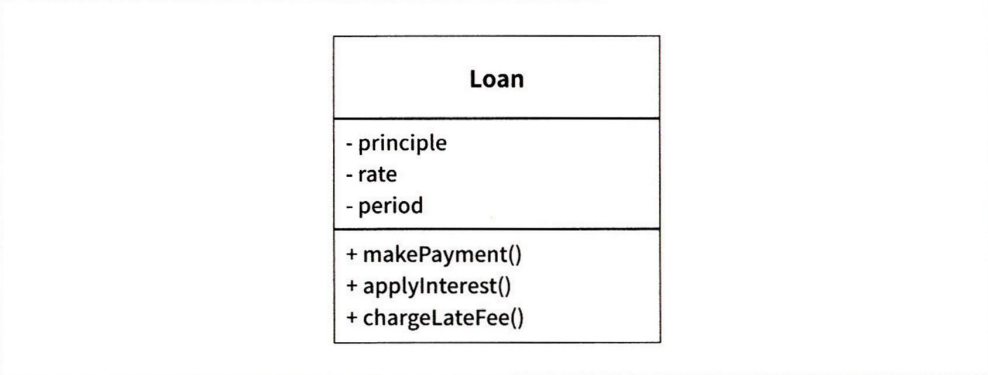

# 아키텍처란?
## 서론
- 소프트웨어 시스템의 아키텍처란 시스템을 구축했던 사람들이 만들어낸 시스템의 형태다.
- 그 모양은 시스템을 컴포넌트로 분할하는 방법, 분할된 컴포넌트를 배치하는 방법, 컴포터는가 서로 의사소통하는 방식에 따라 정해진다.
- 그리고 그 형태는 아키텍처 안에 담긴 소프트웨어 시스템이 쉽게 개발, 배포, 운영, 유지보수되도록 만들어진다.
- 이러한 일을 용이하게 만들기 위해서는 가능한 한 많은 선택지를, 가능한 한 오래 남겨두는 전략을 따라야 한다.
- 아키텍처의 주된 목적은 시스템의 생명주기를 지원하는 것이다.
- 좋은 아키텍처는 시스템을 쉽게 이해하고, 쉽게 개발하며, 쉽게 유지보수하고, 또 쉽게 배포하게 해준다.
- 아키텍처의 궁극적인 목표는 시스템의 수명과 관련된 비용은 최소화하고, 프로그래머의 생산성은 최대화하는 데 있다.

## 선택사항 열어 두기
- 소프트웨어는 행위적 가치와 구조적 가치를 지닌다.
- 구조적 가치가 더 중요하고, 소프트웨어를 부드럽게 만드는 것은 바로 이 구조적 가치이다.
- 모든 소프트웨어 시스템은 주요한 두 가지 구성요소로 분해할 수 있고, 정책(policy)과 세부사항이다.
- 정책 요소는 모든 업무 규칙과 업무 절차를 구체화한다. 시스템의 진정한 가치가 살아 있는 곳이다.
- 세부사항은 사람, 외부 시스템, 프로그래머가 정책과 소통할 때 필요한 요소지만, 정책이 가진 행위에는 조금도 영향을 미치지 않는다.
- 입출력 장치, 데이터베이스, 웹 시스템, 서버, 프레임워크. 통신 프로토콜 등이 있다.
- 아키텍트의 목표는 시스템에서 정책을 가장 핵심적인 요소로 식별하고, 동시에 세부사항은 정책에 무관하게 만들 수 있는 형태의 시스템을 구축하는데 있다. 이를 통해 세부사하을 결정하는 일은 미루거나 연기할 수 있게 된다.

## 결론
- 좋은 아키텍트는 세부사항을 정책으로부터 신중하게 가려내고, 정책이 세부사항과 결합되지 않도록 엄격하게 분리한다.
- 정책은 세부사항에 관한 어떠한 지식도 갖지 못하게 되며, 어떤 경우에도 세부사항에 의존하지 않게 된다.
- 좋은 아키텍트는 세부사항에 대한 결정을 가능한 한 오랫동안 미룰 수 있는 방향으로 정책을 설계한다.

# 독립성

## 서론
- 좋은 아키텍처는 다음을 지원해야 한다.
- 시스템의 유스케이스
- 시스템의 운영
- 시스템의 개발
- 시스템의 배포

## 유스케이스
- 시스템의 아키텍처는 시스템의 의도를 지원해야 한다.
- 아키텍트의 최우선 관심사는 유스케이스이며, 아키텍처에서도 유스케이스가 최우선이다. 아키텍처는 반드시 유스케이스를 지원해야 한다.
- 좋은 아키텍처가 행위를 지원하기 위해 할 수 있는 일 중에서 가장 중요한 사항은 행위를 명확히 하고 외부로 드러내며, 이를 통해 시스템이 지닌 의도를 아키텍처 수준에서 알아볼 수 있게 만드는 것이다.

## 운영
- 시스템의 운영 지원 관점에서 볼 때 아키텍처는 더 실질적이며 덜 피상적인 역할을 맡는다.
- 초당 100,000명의 고객을 처리해야 한다면, 이러한 운영 작업을 허용할 수 있는 형태로 아키텍처를 구조화해야 한다.
- 시스템의 처리 요소를 일련의 작은 서비스들로 배열하여, 열어두어야 하는 선택사항 중의 하나다.

## 개발
- 아키텍처는 개발환경을 지원하는 데 있어 핵심적인 역할을 수행한다.
- 콘웨이의 법칙: 시스템을 설계하는 조직이라면 어디든지 그 조직의 의사소통 구조와 동일한 구조의 설계를 만들어 낼 것이다.
- 잘 격리되어 독립적으로 개발 가능한 컴포넌트 단위로 시스템을 분할할 수 있어야 한다. ( 서로 방해x)

## 배포
- 아키텍처는 배포 용이성을 결정하는 데 중요한 역할을 한다. 목표는 즉각적인 배포다.
- 아키텍처는 수십 개의 작은 설정 스크립트나 속성 파일을 약간씩 수정하는 방식을 사용하지 않는다.
- 좋은 아키텍처는 꼭 필요한 디렉터리나 파일을 수작업으로 생성하게 내버려 두지 않는다.
- 좋은 아키텍처라면 시스템이 빌드된 후 즉각 배포할 수 있도록 지원해야 한다.

# 경계: 선 긋기
## 서론
- 경계는 소프트웨어 요소를 서로 분리하고, 경계 한편에 있는 요소가 반대편에 있는 요소를 알지 못하도록 막는다.
- 핵심적인 업무 로직을 오염시키지 못하게 만들려는 목적이다.
- 아키텍트의 목표는 필요한 시스템을 만들고 유지하는 데 드는 인적 자원을 최소화하는 것이다.
- 인적 자원의 효율을 떨어뜨리는 요인은 결합(coupling)이며, 특히 너무 일찍 내려진 결정에 따른 결합이다.
- 이른 결정 종류: 시스템의 업무 요구사항, 프레임워크, DB, 웹 서버, 유틸리티 라이브러리, 의존성 주입 등
- 좋은 시스템 아키텍처는 이런 결정에 의존하지 않는다.

## 결론
- 소프트웨어 아키텍처에서 경계선을 그리려면 먼저 시스템 컴포넌트 단위로 분할해야 한다.
- 의존성 역전 원칙과 안정된 추상화 원칙을 응용한 것이며, 의존성 화살표는 저수준 세부사항에서 고수준의 추상화를 향하도록 배치된다.

# 경계 해부학
## 서론
- 시스템 아키텍처는 일련의 소프트웨어 컴포넌트와 그 컴포넌트들을 분리하는 경계에 의해 정의된다.
- 이러한 경계는 다양한 형태로 나타난다.

## 경계 횡단하기
- '런타임에 경계를 횡단한다' 함은 그저 경계 한쪽에 있는 기능에서 반대편 기능을 호출하여 데이터를 전달하는 일에 불과하다.
- 적절한 위치에서 경계를 횡단하게 하는 비결은 소스 코드 의존성 관리에 있다.
- 소드 코드 모듈 하나가 변경되면, 이에 의존하는 다른 소스 코드 모듈도 변경하거나, 다시 컴파일해서 새로 배포해야 할지도 모르기 때문이다.
- 경계는 이러한 변경이 전파되는 것을 막는다.

## 두려운 단일체    
- 동적 다형성을 사용하여 저수준 모듈이 고수준 모듈에 유연하게 연결되도록 한다.

## 배포형 컴포넌트
- 동적으로 링크된 라이브러리로 나눈다.

## 스레드
- 단일체, 배포형 컴포넌트 병령 처리가 필요할 때 사용한다.

## 로컬 프로세스
- 로컬 프로세스는 컴포넌트 간 의존성을 동적 다형성을 통해 관리하는 저수준 컴포넌트로 구성된다.

## 서비스
- 가장 강력한 경계
- 자신의 물리적 위치에 구애받지 않는다.
- 모든 통신이 네트워크를 통해 이뤄진다.

# 정책과 수준
## 서론
- 소프트웨어 시스템이란 정책을 기술한 것이다.
- 컴퓨터 프로그램은 각 입력을 출력으로 변환하는 정책을 상세하게 기술한 설명서다.
- 대다수의 주요 시스템에서 하나의 정책은 이 정책을 서술하는 여러 개의 조그만 정책들로 쪼갤 수 있다.
- 동일한 이유로 동일한 시점에 변경되는 정책은 동일한 수준에 위치하며, 동일한 컴포넌트에 속해야 한다.
- 서로 다른 이유로, 혹은 다른 시점에 변경되는 정책은 다른 수준에 위치하며, 반드시 컴포넌트로 분리해야 한다.
- 좋은 아키텍처는 저수준 컴포넌트가 고수준 컴포넌트에 의존하도록 설계되어야 한다.

## 수준
- 수준은 입력과 출력까지의 거리다.
- 시스템의 입력과 출력 모두로부터 멀리 위치할수록 정책의 수준은 높아진다.
- 입력과 출력을 다루는 정책이라면 시스템에서 최하위 수준에 위치한다.
- 고수준 정책은 저수준 정책에 비해 덜 빈번하게 변경되고, 보다 중요한 이유로 변경되는 경향이 있다.
- 모든 소스 코드 의존성이 고수준 정책을 향한다면(저수준 컴포넌트가 고수준 컴포넌트에 플러그인) 변경의 영향도를 줄일 수 있다.
- 시스템의 최저 수준에서 중요하지 않지만 긴급한 변경이 발생하더라도, 보다 높은 위치의 중요한 수준에 미치는 영향이 거의 없게 된다.

# 업무 규칙
## 서론
- 업무 규칙은 사업적으로 수익을 얻거나 비용을 줄일 수 있는 규칙 또는 절차다.
- 더 엄밀하게 말하면 컴퓨터상으로 구현했는지와 상관없이, 업무 규칙은 사업적으로 수익을 얻거나 비용을 줄일 수 있어야 한다.
- 대출에 N%의 이자를 부과한다는 사실은 은행이 돈을 버는 업무 규칙이다.
- 컴퓨터 프로그램으로 이자를 계산하든, 직원이 주판을 튕겨 계산하든 하등이 관계가 없다.
- 이러한 규칙을 핵심 업무 규칙이라 부른다.
- 핵심 업무 규칙은 보통 데이터를 요구한다. 예를 들어 대출에는 대출 잔액, 이자율, 지급 일정이 필요하다. (핵심 업무 데이터)

## 엔티티
- 엔티티는 컴퓨터 시스템 내부의 객체로서, 핵심 업무 데이터를 기반으로 동작하는 일련의 조그만 핵심 업무 규칙을 구체화한다.
- 엔티티 객체는 핵심 업무 데이터를 직접 포함하거나 핵심 업무 데이터에 매우 쉽게 접근할 수 있다.
- 엔티티의 인터페이스는 핵심 업무 데이터를 기반으로 동작하는 핵심 업무 규칙을 구현한 함수들로 구성된다.
- Loan 엔티티는 세 가지의 핵심 업무 데이터를 포함하며, 데이터와 관련된 세 가지 핵심 업무 규칙을 인터페이스로 제공한다.

- 우리는 이러한 종류의 클래스를 생성할 때, 업무에서 핵심적인 개념을 구현하는 소프트웨어는 한데 모으고, 구축 중인 자동화 시스템의 나머지 모든 고려사항과 분리시킨다.
- 독립적으로 존재한다.
- DB, 사용자 인터페이스, 서드파티 프레임워크에 대한 고려사항들로 인해 오염되어서는 절대 안 된다.
- 이 클래스는 어떤 시스템에서도 업무를 수행할 수 있으며, 시스템의 표현 형식이나 데이터 저장 방식, 그리고 해당 시스템에서 컴퓨터가 배치되는 방식과도 무관하다.
- 엔티티는 순전히 업무에 대한 것이며, 이외의 것은 없다.

## 유스케이스  

- 유스케이스는 자동화된 시스템이 사용되는 방법을 설명한다.
- 유스케이스는 사용자가 제공해야 하는 입력, 사용자에게 보여줄 출력, 그리고 해당 출력을 생성하기 위한 처리 단계를 기술한다.
- 애플리케이션에 특화된 규칙을 설명하며, 이를 통해 사용자와 엔티티 사이의 상호작용을 규정한다.
- 엔티티는 자신을 제어하는 유스케이스에 대해 아무것도 알지 못하며, 의존성 역전 원칙을 준수한다.
- 고수준인 엔티티는 저수준인 유스케이스에 대해 알지 못하지만 유스케이스는 엔티티를 알고있다.
- 유스케이스는 단일 애플리케이션에 특화되어 있고, 시스템의 입출력에 가깝에 위치하기 때문에 저수준이다.
- 엔티티는 고수준이다.
- 유스케이스는 엔티티에 의존하는 반면 엔티티는 유스케이스에 의존하지 않는다.

## 결론

- 업무 규칙은 사용자 인터페이스나 데이터베이스와 같은 저수준의 관심사로 인해 오염되서는 안 되며, 원래 그대로의 모습으로 남아 있어야 한다.
- 업무 규칙은 시스템에서 가장 독립적이며 가장 많이 재사용할 수 있는 코드여야 한다.

