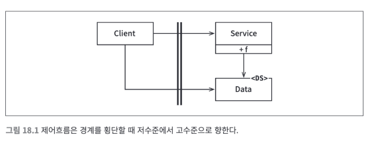
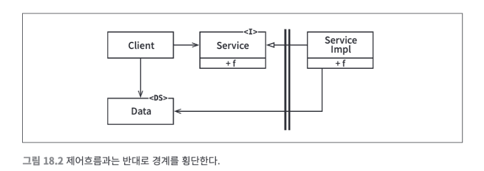
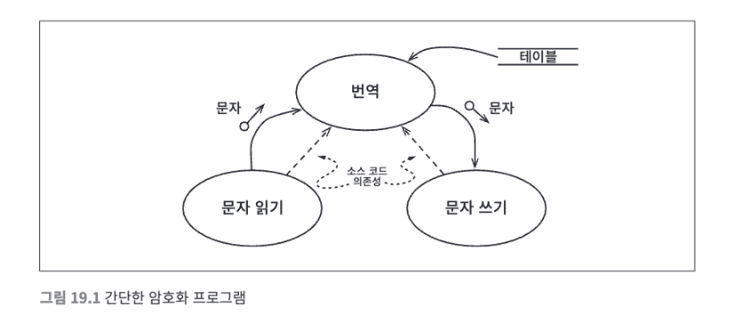

# 15장. 아키텍처란?

소프트웨어는 행위적 가치, 구조적 가치를 가진다.

이 중에서 구조적 가치가 더 중요한데, 이유는 소프트웨어를 부드럽게 만들기 떄문이다.

소프트웨어를 부드럽게 유지하는 방법은 선택사항을 가능한 한 많이, 그리고 오랫동안 열어두는 것이다.

아키텍트의 목표는 시스템에서 정책을 가장 핵심적인 요소로 식별하고, 세부사항은 정책에 무관하게 만들 수 있는 형태의 시스템을 구축하는 것이다.
  1. 고수준의 정책 데이터베이스가 관계형인지, 분산형인지, 계층형인지 등에 관련없는 시스템을 구축해야 한다.
  2. 고수준의 정책은 자신이 웹을 통해 전달된다는 사실을 알아서는 안 된다.
  3. 고수준의 정책은 외부 세계로의 인터페이스에 대해 독립적이어야 한다.
  4. 고수준의 정책은 의존성을 해석하는 방식에 신경 써서는 안 된다.

> 좋은 아키텍트는 결정되지 않은 세부사항의 수를 최대화한다.

# 16장. 독립성

좋은 아키텍처는 다음의 4가지를 지원해야 한다.
1. 유스케이스
2. 운영
3. 개발
4. 배포

### 유스케이스
- 시스템의 아키텍처는 시스템의 의도를 지원해야 한다.
- 아키텍트의 최우선 관심사는 유스케이스이다.
- 아키텍처는 시스템의 행위에 그다지 큰 영향을 주지 않기에 행위와 관련하여 아키텍쳐가
열어둘 수 있는 선택사항은 거의 없다.
- 하지만 좋은 아키텍처는 행위를 지원하기 위해 행위를 명확히 하고 외부로 드려내며,
이를 통해 시스템이 지닌 의도를 아키텍처 수준에서 알아볼 수 있게 만든다.

### 운영
- 아키텍처에서 각 컴포넌트를 적절히 격리하여 유지하고 컴포넌트 간 통신 방식을 특정 형태로
제한하지 않는다면, 시간이 지나 운영에 필요한 요구사항이 바뀌더라도 스레드, 프로세스, 서비스로
구성된 기술 스펙트럼 사이를 전환하는 일이 훨씬 쉬워진다.

### 개발
- 콘웨이 법칙 : "시스템을 설계하는 조직이라면 어디든지 그 조직의 의사소통 구조와 동일한 구조의 설계를 만들어 낼 것이다."
- 많은 팀으로 구성되며 관심사가 다양한 조직에서 어떤 시스템을 개발해야 한다면,
각 팀이 독립적으로 행동하기 편한 아키텍처를 반드시 확보하여 개발하는 동안 팀들이 서로를
방행하지 않도록 해야 한다.
- 컴포넌트를 독립적으로 작업할 수 있는 팀에 할당할 수 있어야 한다.

### 배포
- 아키텍처는 배포 용이성을 결정하는 중요한 역할을 하는데 이 떄 목표는 '즉각적인 배포'다.
- 좋은 아키텍처라면 시스템이 빌드된 후 즉각 배포할 수 있도록 지원해야 한다.
- 즉각 배포 가능한 컴포넌트에는 마스터(메인) 컴포넌트도 포함된다.

### 선택사항 열어놓기
- 좋은 아키텍처는 컴포넌트 구조와 관련된 여러 관심사들 사이에서 균형을 맞추고 모든 관심사를 만족시켜야 한다.
- 관심사, 목표는 시스템 생명주기의 단계를 거쳐감에 따라 변해갈 수 있지만 
몇몇 아키텍처 원칙은 비싸지 않은 비용으로 관심사들 사이의 균형을 잡는데 도움이 될 수 있다.
- 좋은 아키텍처는 선택사항을  열어 둠으로써, 향후 시스템에 변경이 필요할 때 어떤 방향으로든 쉽게 변경할 수 있도록 한다.

### 계층 결합 분리
- 사용자 인터페이스가 변경되는 것과 업무 규칙에는 아무런 관련이 없다.
- 하지만 유스케이스가 두 가지를 모두 포함한다면 아키텍트는 UI부분과 업무 규칙 부분을 서로 분리하여 독립적으로 변경할 수 있도록 할 것이다.
- 데이터베이스, 쿼리 언어, 스키마도 기술적인 세부사항이며, 업무 규칙이나 UI와는 아무 관련이 없다.
- 이들은 시스템의 다른 측면과는 다른 속도와 이유로 변경된다.
- 결론적으로 아키텍트는 이들을 시스템의 나머지 부분으로부터 분리하여 독립적으로 변경할 수 있도록 해야 한다.

### 유스케이스 결합 분리
- 유스케이스 그 자체로도 서로 다른 이유로 변경될 수 있다.
- 유스케이스는 시스템을 분할하는 자연스러운 방법이다.
- 유스케이스 안에서 업무 규칙, DB 등을 분리하다보면 시스템의 맨 아래 게층까지 수직으로 내려가며
유스케이스들이 각 게층에서 서로 겹치지 않게 한다.
- 시스템에서 서로 다른 이유로 변경되는 요소들을 계속해서 분리하다보면 기존 요소에 지장을 주지 않고도 새로운 유스케이스를 계속해서 추가할 수 있다.

### 결합 분리 모드
- 운영 측면에서 이점을 살리기 위해선 결합을 분리할 때 적절한 모드를 선택해야 한다.
- 예를 들어, 분리된 컴포넌트를 서로 다른 서버에서 실행해야 하는 상황이라면, 
이들 컴포넌트가 단일 프로세서의 동일한 주소 공간에 함께 상주하는 형태로 만들어져서는 안 된다.
- 분리된 컴포넌트는 반드시 독립된 서비스가 되어야 하고, 일종의 네트워크를 통해 서로 통신해야 한다.
- 이를 MSA라고 부를 수도 있지만 구분 기준이 모호한 면이 있어 일반적으로 실제 서비스에 기반한 아키텍처를 '서비스 지향 아키텍처(SOA)'라고 부른다.

### 중복
- 아키텍트는 전적으로 중복에 대한 공포로부터 발생하는 함정에 빠지곤 한다.
- 중복에는 여러 종류가 있는데 이 중 우발적인 중복을 조심해야 한다.
- 중복으로 보이는 두 코드 영역이 각자의 경로로 발전한다면, 서로 다른 속도와 이유로 변경이 된다면 중복이 아닌 것이다.
- 유스케이스를 수직으로 분리할 때 이러한 문제를 마주칠 것이며, 이들 유스케이스를 통합하고 싶다는 유혹을 받을 수 있지만
우발적인 중복을 분리하고자 하는 노력을 피하고 계층 간 결합을 적절하게 분리해야 한다.

### 결합 분리 모드 (다시)
- **소스 수준 분리 모드**
  - 소스 코드 모듈 사이의 의존성을 제어할 수 있다.
  - 하나의 모듈이 변경되어도 다른 모듈을 변경하거나 재컴파일하지 않도록 만들 수 있다.
  - 이 모드에서는 모든 컴포넌트가 같은 주소 공간에서 실행되고 컴퓨터 메모리에는 하나의 실행 파일만이 로드되는데 이를 모노리틱 구조라고 부른다.
- **배포 수준 분리 모드**
  - jar 파일, DLL, 공유 라이브러리와 같이 배포 가능한 단위들 사이의 의존성을 제어할 수 있다.
- **서비스 수준 분리 모드**
  - 의존하는 수준을 데이터 구조 돤위로 낮출 수 있다.

- 프로젝트 초기 단계에서는 어떤 모드가 최선인지 알 수 없다.
- 프로젝트가 성숙해갈수록 최적의 모드가 달라질 수 있기 때문이다.
- 가장 일반적인 해결책은 단순히 서비스 수준에서의 분리를 기본 정책으로 삼는 것이다.
- 하지만 서비스 수준의 분리는 비용이 비싸고 개발 시간이 길어지며 시스템 자원 측면에서도 비용이 비싸다는 것이다.
- 따라서 처음에는 소스 코드 수준에서 분리하고, 배포나 개발에서 문제가 생기면 일부 결합을 배포 수준까지 분리한다.
- 개발, 배포, 운영적인 문제가 증가하면 서비스 수준으로 전환할 배포 단위를 선택하여 점차적으로 서비스화 하는 방향으로 시스템을 변경해 나간다.

# 17장. 겅계: 선 긋기

- 소프트웨어 아키텍처는 선을 긋는 기술이며 이 선은 소프트웨어 요소를 분리하고 경계 한편에 있는 요소가 반대편에 있는 요소를 알지 못하도록 막는다.
- 이러한 경계(선)은 코드가 전혀 작성되기도 전에 그어지기도 하며 이러한 선들은 가능한 한 오랫동안 
결정을 연기시키기 위해, 그래서 이들 결정이 핵심적인 업무 로직을 오염시키지 못하도록 하기 위해 쓰인다.

### 어떻게 선을 그을까? 언제 그을까?
- GUI와 업무 규칙은 관련이 없기 때문에 반드시 선이 있어야 한다.
- 데이터베이스는 업무 규칙이 간접적으로 사용할 수 있는 도구이며 업무 규칙이 알아야 할 것은
데이터를 가져오고 저장할 때 사용할 수 있는 함수 집합이 있다는 사실 뿐이다.
- 데이터베이스는 업무 규칙을 알지만 업무 규칙은 데이터베이스를 알지 못한다.

### 플러그인 아키텍처
- 아키텍트는 특정 모듈이 나머지 모듈에 영향받지 않기를 바란다.
- 시스템에서 한 부분이 변경되더라도 관련 없는 나머지 부분이 망가지지 않길 원한다.
- 시스템을 플러그인 아키텍처로 배치하면 변경이 절파될 수 없는 방화벽을 생성할 수 있다.

> ## 플러그인 아키텍처
> ### 개요
> - 변화하는 시스템 요구사항에 적응하기 위함.
> - 확장기능을 연결하고 기능간의 협력을 조율하기 위한 소켓 역할 수행
> ### 구조
> - 응용 프로그램 구조는 독립적인 플러그인 모듈과 기본 핵심 시스템 사이에 나누어짐.
> - 핵심 시스템
>   - 시스템을 운영 가능하게 하는 데 필요한 최소한의 기능만 포함
> - 플러그인 모듈
>   - 독립적인 구성 요소
>   - 전문 처라, 추가 기능 및 사용자 정의 코드를 포함
>   - 핵심 시스템을 확장하여 추가 비즈니스 기능 생성
> ### 고려사항
> - 플러그인 간의 통신을 최소화하여 종속성 문제를 피한다.

# 18장. 경계 해부학

### 경계 횡단하기
- 적절한 위치에서 경게를 횡단하게 하는 비결은 소스 코드 의존성 관리에 있다.
- 소스 코드 모듈 하나가 변경되면 이에 의존하는 모든 소스 코드 모듈도 변경 또는 배포해야 하기 때문이다.
- 이러한 변경을 막기 위해 경계가 필요하다.

### 두려운 단일체
- 아키텍처 경계 중에서 가장 단순하며 흔한 형태는 물리적으로 엄격하게 구분되지 않는 형태이다.
- 함수와 데이터가 단일 프로세서에서 같은 주소 공간을 공유하며 그저 나름의 규칙으로 분리되어 있을 뿐이다.
- 배포 관점에서 보면 이는 '단일체'라고 불리는 단일 실행 파일에 지나지 않는다.
- 배포 관점에서 보면 단일체는 경게가 드러나지 않는다.
- 이러한 아키텍처는 거의 모둔 경우에 특정한 동적 다형성에 의존하여 내부 의존성을 관리한다.
- 여기서 말하는 동적 다형성은 제네릭, 템플릿과 같은 것이며 이러한 동적 다형성이 없었다면 포인터에 과도하게 의존하는 방식을 사용해야 했을 것이다.

- 가장 단순한 형태의 경계 횡단은 저수준 클라이언트에서 고수준 서비스로 향하는 함수 호출이다.

- 만약 고수준 클라이언트가 저수준 서비스를 호출해야 한다면 동적 다향성을 사용하여 제어흐름과는 반대 방향으로 의존성을 역전시킬 수 있다.
- 이렇게 하면 런타임 의존성은 컴파일 타임 의존성과 반대가 된다.

### 배포형 컴포넌트
- 아키텍처의 경계가 물리적으로 드러나는 가장 단순한 형태는 동적 링크 라이브러리다.
- Jar, DLL 등이 그 예시이다.
- 컴포넌트를 이러한 형태로 배포하면 따로 컴파일하지 않고 곧바로 사용할 수 있지만 대신 컴포넌트는 바이너리와 같이 배포 가능한 형태로 전달된다.
- 배포 과정에서만 차이가 날 뿐, 배포 수준의 컴포넌트는 단일체와 동일하다.
- 단일체와 마찬가지로 배포형 컴포넌트의 경계를 가로지르는 통신은 순전히 함수 호출에 지나지 않으므로 매우 값싸다.

### 스레드
- 단일체와 배포형 컴포넌트는 모두 스레드를 활용할 수 있다.
- 스레드는 실행 계획과 순서를 체계화하는 방법에 가까우며 모든 스레드가 하나의 컴포넌트에 포함될 수도 있고 많은 컴포넌트에 걸쳐 분산될 수도 있다.

### 로컬 프로세스
- 강한 물리적 형태를 띠는 아키텍쳐 경계로는 로컬 프로세스가 있다.
- 로컬 프로세스는 주로 명령행이나 그와 유사한 시스템 호출을 통해 생성된다.
- 로컬 프로세스들은 동일한 프로세서 또는 하나의 멀티코어 시스템에 속한 여러 프로세서들에서 실행되지만, 각각이 독립된 주소 공간에서 실행된다.
- 로컬 프로세스는 컴포넌트 간 의존성을 동적 다형성을 통해 관리하는 저수준 컴포넌트로 구성된다.
- 따라서 로컬 프로세스에서는 고수준 프로세스의 소스 코드가 저수준 프로세스의 이름, 물리 주소, 레지스트리 조회 키를 절대 포함해서는 안 된다.
- 이유는 저수준 프로세스가 고수준 프로세스의 플러그인이 되도록 만드는 것이 아키텍처의 관점의 목표이기 때문이다.

### 서비스
- 물리적인 형태를 띠는 가장 강력한 경계는 서비스다.
- 서비스는 자신의 물리적 위치에 구애받지 않으며 서로 통신하는 두 서비스는 물리적으로 동일한 프로세서나 멀티코어에서 동작할 수도 있고, 아닐 수도 있다.
- 서비스 경계를 지나는 통신은 함수 호출에 비해 매우 느리기 때문에 주의를 기울여서 가능하다면 빈번하게 통신하는 일을 피해야 한다.
- 이 수준의 통신에서는 지연에 따른 문제를 고수준에서 처리해야 한다.

# 19장. 정책과 수준
- 대다수의 주요 시스템에서의 하나의 정책은 이 정책을 서술하는 여러 개의 조그만 정책들로 쪼갤 수 있다.
- 동일한 이유로 동일한 시점에 변경되는 정책은 동일한 수준에 위치하며, 동일한 컴포넌트에 속해야 한다.
- 좋은 아키텍처라면 각 컴포넌트를 연결할 때 의존성의 방향이 컴포넌트의 수준을 기반으로 연결되도록 만들어야 한다.
- 즉, 저수준 컴포넌트가 고수준 컴포넌트에 의존하도록 설계되어야 한다.

### 수준
- 수준을 엄밀하게 정의하자면 '입력과 출력까지의 거리'다.
- 시스템의 입력과 출력 모두로부터 멀리 위치할수록 정책의 수준은 높아진다.
- 따라서 입력과 출력을 다루는 정책은 시스템에서 최하위 수준에 위치한다.

- 그림에서 주목할 점은 데이터 흐름과 소스 코드 의존성이 항상 같은 방향을 가리키지는 않는다는 것이다.
- 소스 코드 의존성은 그 수준에 따라 결합되어야 하며, 데이터 흐름을 기준으로 결합되어서는 안 된다.

- 정책을 컴포넌트로 묶는 기준은 정책이 변경되는 방식에 달려있다.
- 저수준 정책은 입력과 출력에 가까이 위치하기에 더 빈번하게 변경되며, 보다 긴급성을 요하고, 덜 중요한 이유로 변경된다.

# 20장. 업무 규칙
- 업무 규칙은 사업적으로 수익을 얻거나 비용을 줄일 수 있는 규칙 또는 절차이다.
- 컴퓨터상 구현 여부와는 상관없이, 업무 규칙은 사업적으로 수익을 얻거나 비용을 줄일 수 있어야 한다.

### 엔티티
- 엔티티는 컴퓨터 시스템 내부의 객체로서, 핵심 업무 데이터를 기반으로 동작하는 일련의 조그만 핵심 엄무 규칙을 구체화한다.
- 엔티티는 순전히 업무에 대한 것이며, 시스템의 표현 형식이나 저장 방식, 배치 방식과 무관하다.

### 유스케이스
- 모든 업무 규칙이 엔티티처럼 순수한 것은 아니며, 자동화된 시스템이 동작하는 방법을 정의하고 제약함으로써 존재할 수도 있다.
- 그것이 바로 유스케이스다.
- 유스케이스는 사용자가 제공해야 하는 입력, 사용자에게 보여줄 출력, 출력을 생성하기 위한 처리 단계를 기술한다.
- 엔티티 내의 핵심 업무 규칙과는 반대로 유스케이스는 애플리케이션에 특화된 업무 규칙을 설명한다.
- 유스케이스는 엔티티 내부의 핵심 업무 규칙을 어떻게 언제 호출할 지 명시하는 규칙을 담으며 엔티티의 동작 방식을 제어한다.
- 주목할 점은 인터페이스로 들어오는 데이터와 인터페이스에서 되돌려주는 데이터를 형식 없이 명시한다는 점만 뺴면 유스케이스는 사용자 인터페이스를 기술하지 않는다.
- 즉, 유스케이스만 봐서는 애플리케이션이 웹을 통해 전달되는지, 콘솔 기반인지, 순수한 서비스인지 구분할 수 없다.
- 유스케이스는 애플리케이션에 특화된 규칙을 설명하고 사용자와 엔티티 사이의 상호작용을 규정하지만 시스템에서 데이터가 들어오고 나가는 방식과는 무관하다.
- 하지만 엔티티는 자신을 제어하는 유스케이스에 대해 아무것도 알지 못한다.
- 이는 의존성 역전 원칙을 준수하는 의존성 방향에 대한 또 다른 예시로서, 엔티티와 같은 고수준 개념은 유스케이스와 같은 저수준 개념에 대해 알 수 없다.
- 유스케이스가 저수준인 이유는 단일 애플리케이션에 특화되어 있어 해당 애플리케이션의 입력과 출력에 보다 가깝게 위치하기 때문이다.
- 엔티티는 수많은 다양한 애플리케이션에서 사용될 수 있도록 일반화된 것이므로 고수준이다.

### 요청 및 응답 모델
- 제대로 구성된 유스케이스는 데이터를 사용자나 또 다른 컴포넌트와 주고 받는 방식에 대해 전혀 알 수 없어야 한다.
- 요청 및 응답 모델이 독립적이지 않다면, 그 모델에 의존하는 유스케이스도 결국 해당 모델이 수반하는 의존성에 간접적으로 결합되어 버린다.
