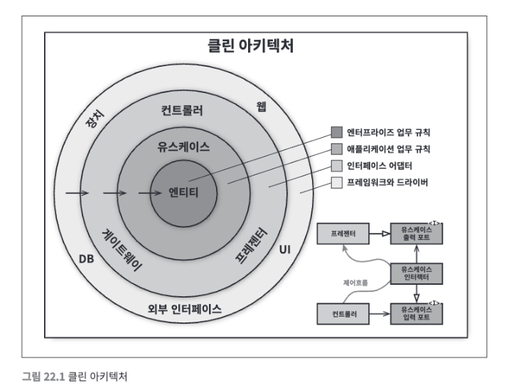
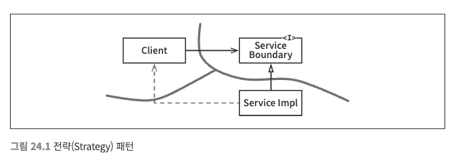
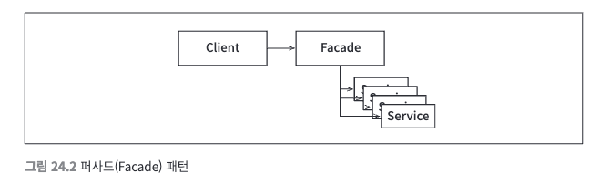

# 21장. 소리치는 아키텍처

### 아키텍처의 테마
- 프레임워크는 사용하는 도구일 뿐, 아키텍처가 준수해야 할 대상이 아니다.

### 아키텍처의 목적
- 주택으로 예시를 들면, 아키텍트가 주목하는 관심사는 주택이 거주하기에 적합한 공간임을 확실히 하는 것이며,
주택이 어떤 재료로 지어지는 지를 확인하는 것이 아니다.
- 그렇기에 좋은 소프트웨어 아키텍처는 프레임워크, 데이터베이스, 웹 서버 그리고 여타 개발 환경 문제가 도구에 대해서는 결정을 미룰 수 있도록 만든다.
- 좋은 아키텍처는 유스케이스에 중점을 두며, 지엽적인 관심사에 대한 결합을 분리시킨다.

### 프레임워크는 도구일 뿐, 삶의 방식은 아니다.
- 프레임워크가 모든 것을 담당하게 하지 말고 비판적으로 바라보며 유스케이스에 중점을 두어야 한다.

### 테스트하기 쉬운 아키텍처
- 아키텍처가 유스케이스를 최우선으로 한다면, 프레임워크를 전혀 준비하지 않더라도 필요한 유스케이스 전부에 대해 단위 테스트를 할 수 있어야 한다.
- DB, Web과 같은 지엽적인 것이 필요하여 테스트가 불가능한 상황이 생기면 안 된다.

# 22장. 클린 아키텍처
- 시스템 아키텍처의 공통점이 있다면 모두 관심사의 분리를 실현하는 것이다.
- 소프트웨어를 계층으로 분리하여 관심사를 분리한다.
- 각 아키텍처는 최소한의 업무 규칙을 위한 계층 하나와, 사용자와 시스템 인터페이스를 위한 또 다른 계층 하나를 반드시 포함한다.

### 의존성 규칙
- 위의 사진에서 바깥 원은 메커니즘으로 저수준이며 안쪽 원은 정책으로 고수준이다.
- 소스 코드 의존성은 반드시 안쪽으로, 고수준의 정책을 향해야 한다.
- 내부의 원에 속한 요소는 외부의 원에 속한 어떤 것도 알지 못한다.
- 따라서 외부 원에 위치한 어떤 것도 내부 원에 영향을 주면 안 된다.

### 엔티티
- 엔티티는 전사적인 핵심 업무 규칙을 캡슐화한다.
- 운영 관점에서 특정 애플리케이션에 무언가 변경이 필요하더라도 엔티티 계층에는 절대로 영향을 주어서는 안 된다.

### 유스케이스
- 유스케이스 계층의 소프트웨어는 애플리케이션에 특화된 업무 규칙을 포함한다.
- 또한, 유스케이스 계층의 소프트웨어는 시스템의 모든 유스케이스를 캡슐화하고 구현한다.
- 유스케이스는 엔티티로 들어오고 나가는 데이터 흐름을 조정하며, 엔티티가 자신의 핵심 업무 규칙을 사용해서 유스케이스의 목적을 달성하도록 이끈다.
- 유스케이스 계층도 다른 저수준의 변경에 영향을 받으면 안되며 유스케이스가 변경되어도 엔티티에 영향을 주어서는 안 된다.
- 하지만, 애플리케이션이 변경되면 유스케이스는 영향을 받게 된다.

### 인터페이스 어댑터
- 어댑터는 데이터를 유스케이스와 엔티티에게 가장 편리한 형식에서 데이터베이스나 웹 같은 외부 에이전시에게 가장 편리한 형식으로 변환한다.

### 프레임워크와 드라이버
- 프레임워크와 드라이버 계층은 모든 세부사항이 위치하는 곳이다.
- 이들을 외부에 위치시켜서 변경의 영향을 최소화한다.

### 경계를 횡단하는 데이터
- 경계를 횡단할 때는 간단한 데이터 구조로 이루어져야 하며 엔티티 객체나 데이터베이스의 행을 전달하면 안 된다.
- 데이터는 항상 내부의 원에서 사용하기에 가장 편리한 형태로 이동해야 한다.

# 23장. 프레젠터와 험블 객체

### 험블 객체 패턴
- 험블 객체 패턴은 디자인 패턴으로, 테스트하기 어려운 행위와 테스트하기 쉬운 행위를 단위 테스트 작성자가 분리하기 쉽게 하는 방법으로 고안되었다.
- 행위들을 두 개의 모듈 또는 클래스로 나눈다. 이들 모듈 중 하나는 험블로써, 테스트하기 어려운 행위를 모두 험블 객체로 옮긴다. 나머지 모듈에는 테스트 하기 쉬운 행위를 모두 옮긴다.

### 프레젠터와 뷰
- 뷰는 험블 객체이고 테스트하기 어렵다. 데이터를 GUI로 이동시키지만 데이터를 직접 처리하지는 않는다.
- 프레젠터는 테스트하기 쉬운 객체다. 프레젠터의 역할은 애플리케이션으로부터 데이터를 받아 화면에 표현할 수 있는 포맷으로 만드는 것이다.
- 이를 통해 뷰는 데이터를 화면으로 전달하는 간단한 일만 처리하도록 만든다.

### 데이터베이스 게이트웨이
- 유스케이스 인터랙터와 데이터베이스 사이에는 데이터베이스 게이트웨이가 위치한다.
- 이 게이트웨이는 다형적 인터페이스로, 애플리케이션이 데이터베이스에 수행하는 생성, 조회, 갱신, 삭제 작업과 관련된 모든 메서드를 포함한다.
- 유스케이스 계층은 SQL을 허용하지 않기 때문에 필요한 메서드를 제공하는 게이트웨이 인터페이스를 호출한다.
- 인터랙터는 애플리케이션에 특화된 업무 규칙을 캡슐화하기 때문에 험블 객체가 아니며 스텁이나 테스트 더블로 교체가 가능하여 테스트하기 쉽다.

### 데이터 매퍼
- ORM(데이터 매퍼)는 데이터베이스 계층에 속하며 게이트웨이 인터페이스와 데이터베이스 사이에서 일종의 또 다른 험블 객체 경계를 형성한다.

# 24장. 부분적 경계

### 마지막 단계를 건너뛰기
- 부분적 경계를 생성하는 방법 하나는 독립적으로 컴파일하고 배포할 수 있는 컴포넌트를 만들기 위한 작업은 모두 수행한 후, 단일 컴포넌트에 그대로 모아만 두는 것이다.
- 이 방법의 장점은 다수의 컴포넌트를 관리하는 작업이 필요하지 않으며 추적을 위한 버전 번호도 없으며 배포 관리 부담도 없다.

### 일차원 경계
- 완벽한 형태의 아키텍처 경계는 양방향으로 격리된 상태를 유지해야 하므로 쌍방향 Boundary 인터페이스를 사용한다.
- 이렇게 양방향으로 격리된 상태를 유지하려면 초기 설정할 때나 지속적으로 유지할 때도 비용이 많이 든다.
- 추후 완벽한 형태의 경계로 확장할 수 있는 공간을 확보하고자 할 때 활용할 수 있는 패턴으로 "Strategy 패턴"이 있다.

- Service Boundary 인터페이스는 클라이언트가 사용하며 ServiceImpl 클래스가 구현한다.
- Client를 ServiceImpl로부터 격리시키는데 필요한 의존성 역전이 마련되었기 떄문에 미래에 필요할 아키텍처 경계를 위한 준비가 되었다.
- 하지만 이러한 분리는 매우 빠르게 붕괴될 수 있다.
- 쌍방향 인터페이스가 없고 아키텍트가 항시 확인하지 않는다면 점선과 같은 통로가 생길 수 있다.

### 퍼사드
- 더 단순한 경계로는 퍼사드 패턴이 있다.

- 의존성 역전을 희생하고 경계는 Facade 클래스로만 간단하게 정의된다.
- Facade 클래스에는 모든 서비스 클래스를 메서드 형태로 정의하고 서비스 호출이 발생하면 해당 서비스 클래스로 호출을 전달한다.

# 25장. 계층과 경계

### 흐름 분리하기
- 아키텍트에서 모든 흐름이 상단의 단일 컴포넌트에서 만난다고 생각할 수 있지만 살펴보면 더 높은 수준에는 또 다른 정책 집합이 존재할 수 있다.
- 일반적으로 업무 규칙이 최상단에 위치하여 컨트롤하게 되는데 여러 기능이 추가되다보면 타 업무규칙과 연결되고 업무규칙 사이의 아키텍처 경계를 발견할 수 있다.
- 아키텍처 경계는 어디에나 존재한다.

### 결론
- 아키텍트는 아키텍처 경계가 언제 필요한지를 신중하게 파악해야 하고 그러한 아키텍처 경계를 무시하면 다시 추가하는 비용이 크다는 사실을 인지해야 한다.
- YANGNI의 철학으로서 경계를 무시하면 안되지만 추상화를 미리 예측해서는 안 된다.
- 오버 엔지니어링이 언더 엔지니어링보다 나쁠 때가 훨씬 많다.
- 프로젝트 초반에는 구현할 경계가 무엇인지 무시할 경계인지 쉽게 결정할 수 없다.
- 대신 지켜봐야 하며 시스템이 발전함에 따라 주의를 기울여 경계가 필요해지는 순간을 관찰해야 한다.

# 26장. 메인 컴포넌트
- 모든 시스템에는 최소한 하나의 메인 컴포넌트가 존재하고 이 컴포넌트는 나머지 컴포넌트를 생성하고 조정하며 관리한다.

### 궁극적인 세부사항
- 메인 컴포넌트는 궁극적인 세부사항으로 가장 낮은 수준의 정책이다.
- 메인 컴포넌트는 모든 팩토리와 전략, 그리고 시스템 전반을 담당하는 나머지 기반 설비를 생성한 후, 시스템에서 더 높은 수준을 담당하는 부분으로 제어권을 넘기는 역할을 한다.
- 의존성 주입은 이 메인 컴포넌트에서 이루어져야 한다.
