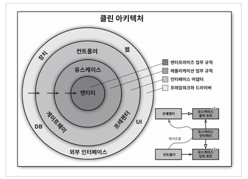
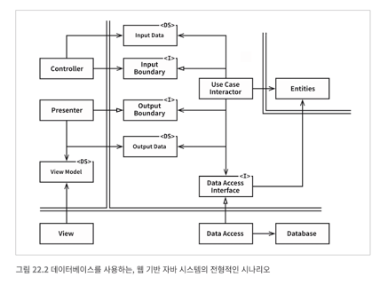
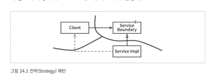
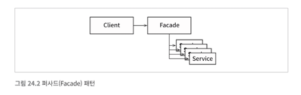

## 21 소리치는 아키텍처

소프트웨어 애플리케이션의 아키텍처도 애플리케이션의 유스케이스에 대해 소리쳐야 한다.
아키텍처는 프레임 워크에 대한 것이 아니다.
아키텍처를 프레임워크로부터 제공받아서는 안되며 사용하는 도구일 뿐, 준수해야 할 대상이 아니다. 
아키텍처를 프레임워크 중심으로 만들어버리면 유스케이스가 중심이 되는 아키텍처는 절대 나올 수 없다.

좋은 소프트웨어 아키텍처는 프레임 워크, DB, WS 등을 미룰 수 있도록 한다.
좋은 아키텍처는 유스케이스에 중점을 두며, 지엽적인 관심사에 대한 결합은 분리시킨다. 

예시로 웹은 입출력 장치이며 세부사항이다. 시스템 구조를 지배해서는 안된다.
프레임워크도 도구일 뿐이다. (프레임워크가 아키텍처의 중심을 차지하는 일을 막을 수 있는 전략을 개발하라.)

만약 누군가 뷰와 컨트롤러는 어디에 있냐 물으면 "그것은 세부사항이므로 당장은 고려할 필요가 없습니다. 나중에 결정할것입니다." 라 말하라

## 22 클린 아키텍처
### 육각형 아키텍처, DCI, BCE등 다양한 아키텍처는 관심사의 분리에 초점을 맞춘다. 
- 프레임 워크 독립성 : 다양한 기능의 라이브러리를 제공하는 소프트웨어 프레임워크의 존재 여부에 의존하지 않는다.
- 테스트 용이성 : UI, DB, WAS등의 영향받지 않고 테스트 가능해야한다.
- UI 독립성 : 시스템의 나머지 부분을 변경하지 않고도 UI를 쉽게 변경할 수 있다.
- DB 독립성, 모든 외부 에이전시에 대한 독립성 실제 업무 규칙은 외부 세계와의 인터페이스 대해 전형 알지 못한다.

### 의존성 규칙   
-     
- 소스코드 의존성은 반드시 안쪽으로, 고수준의 정책을 향해야 한다. 
- 내부의 원에 속한 요소는 외부의 원에 속한 어떤것도 알지 못한다. 
- 같은 이유로, 외부의 원에 선언된 데이터 형식도 내부의 원에서 사용되어서는 안된다.

### 엔티티 
- 가장 일반적이며 고수준인 규칙을 캡슐화 한다. 
- 외부의 무언가가 변경되어도 엔티티 계층에는 절대로 영향을 주어서는 안된다.

### 유스케이스 
- 이 계층에서 발생한 변경이 엔티티에 영향을 주어서는 안된다.
- 애플리케이션에 특화된 업무 규칙을 포함한다. 
- 유스케이스의 세부사항이 변하면 이 계층의 코드 일부는 분명 영향을 받을 것이다.

### 인터페이스 어댑터
- GUI의 프레젠터 ,뷰, 컨트롤러는 모두 인터페이스 어댑터 계층에 속한다. 
- 데이터를 엔티티와 유스케이스에게 가장 편리한 형식에서 영속성용으로 사용 중인 임의의 프레임워크가 이용하기에 가장 편리한 형식으로 변환한다.

### 프레임워크와 드라이버 
- 안쪽 원과 통신하기 위한 접합 코드 위주이다.
- 모든 세부사항이 위치하는 곳이다.
- DB, WS등이 속한다. 

### 기타 
- 원이 반드시 내게여야하는것은 아니다. 
- 각 의존성은 유스케이스를 향해 안쪽을 카리킨다.
- 경계를 가로지르는 데이터는 간단한 구조로 이루어저 구조체, dto등을 고를 수 있다. 이때 엔티티를 전달하는것은 삼가하는것이 좋다. 
- 경계를 가로지르는 경우에는 데이터는 항상 내부의 원에서 사용하기에 가장 편리한 형태를 가져야한다.
- 
- 의존성의 방향이 경계선을 안쪽으로 가로지으며, 의존성 규칙을 준수한다.

## 23 프레젠터와 험블 객체 
### 험블 객체 패턴
- 테스트 하기 어려운 행위와 테스트 하기 쉬운 행위를 단위 테스트 작성자가 분리하기 쉽게 하는 디자인 패턴이다.
- 행위들을 두 개의 모듈 또는 클래스로 나눈후 이들 모듈 중 하나가 험블이다. 
- 가장 기본적인 본질은 남기고 테스트하기 어려운 행위를 모두 험블 객체로 옮긴다. 나머지 모듈에는 험블객체에 속하지 않은 테스트하기 쉬운 행위를 모두 옮긴다.
- 험블 객체 패턴을 사용하면 두 부류의 행위를 분리하여 프렌젠터와 뷰라는 서로 다른 클래스로 만들 수 있다. 

### 프렌젠터와 뷰 
- 뷰는 험블 객체이고 테스트하기 어렵다.
- 프레젠터는 테스트 하기 쉬운 객체이다. (여기까지만 테스트 하면 된다)
- 뷰에 보이는 것들, 맡은 역할은 전혀 없다. 따라서 뷰는 보잘것 없다.

### 테스트와 아키텍처
- 험블객체 패턴은 행위를 테스트하기 쉬운 부분과 테스트 하기 어려운 부분으로 분리하면 아키텍처 경계가 정의된다.

### 데이터베이스 게이트웨이
- 유스케이스 계층은 SQL을 허용하지 않는다. 따라서 유스케이스 게층은 필요한 메서드를 제공하는 게이트웨이 인터페이스를 호출한다. 
- 그리고 인터페이스의 구현체는 데이터베이스 계층에 위치한다. 
- 이 구현 체는 험블 객체이다. 
- 구현체에서 직접 SQL을 사용하거나 데이터베이스에 대한 임의의 인터페이스를 통해 게이트웨이의 메서드에서 필요한 데이터에 접근한다. 
- 인터렉터는 애플리케이션에 특화된 업무규칙을 캡슐화 하기 떄문에 험블객체가 아니다. 따라서 테스트하기 쉬운데 게이트웨이는 스텁이나 테스트더블로 적당히 교체할 수 있기 때문이다. ([] 인터렉터?)

### 데이터 매퍼
- ORM은 사실 존재하지 않는다. (차라리 데이터 매퍼라고 부르는것이 나아보인다.)
- 실제로 ORM은 게이트웨이 인터페이스와 데이터베이스 사이에서 일종의 또 다른 험블 객체 경계를 형성한다. 

### 서비스 리스너
- 외부 서비스와 통신해야한다면 서비스 경계를 생성하는 험블 객체패턴을 발견할 수 있다. 
- 외부서비스에 전송, 반대로 외수로부터 데이터를 수신하는 서비스의 경우 서비스 리스너가 서비스 인터페이스로부터 데이터를 수신하고, 데이터를 애플리케이션에서 사용할 수 있게 간단한 데이터 구조로 포맷을 변경한다. 그런 후 이 데이터 구조는 서비스 경계를 가로질러 내부로 전달 된다.

### 결론
- 각 아키테처의 경계마다 험블객체 패턴을 발견할 수 있을것이다. 
- 테스트 하기 어려운것과 쉬운것을 분리하고 험블 객체 패턴을 사용하며 시스템의 테스트 용이성을 높일 수 있을것이다. 

## 24 부분적 경계
- 아키텍처 경계를 완벽하게 만드는 데는 비용이 많이 든다. 
- 이런경우 부분적 경계를 구현해볼 수 있다.

### 마지막 단계를 건너 뛰기
- 독립적으로 컴파일 하고 배포할 수 있는 컴포넌트를 만들기 위한 작업은 모두 수행한 후 단일 컴포넌트에 그대로 모아만 두는 것이다. 
- 모든것이 한번에 존재하지만 모두를 단일 컴포넌트로 컴파일 해서 배포한다.
- 다수의 컴포넌트를 관리하는 작업을 하지 않아도 되기에 비용이 적게든다. 

### 일차원 경계
- 완벽한 형태의 아키텍처 경계는 양방향으로 격리된 상태를 유지해야하므로 쌍방향 인터페이스를 사용한다.
- 
- 추후 완벽한 형태의 경계로 확장할 수 있는 공간을 확보하고자 할때 활용할 수 있는 구조로 전략패턴을 사용한 예시가 있다.  
- 양방향 인터페이스가 없고 개발자와 아키텍처가 훈려되어 있지 않다면 점선과 같은 비밀통로가 생길일을 막을 수 없다.

### 퍼사드
- 더 간단한 경계는 파사드 패턴이다.(이 경우는 의존성 역전 원칙도 희생한다.)
- 
- 모든 서비스 클래스를 메서드 형태로 정의하고 서비스 호출이 발생하면 해당 서비스 클래스로 호출을 전달한다. 
- 하지만 클라이언트가 추이 종속성을 가지게 되어 하나라도 소스코드가 변경되면 재 컴파일을 해야한다.

### 결론
- 마지막 단계 건너 뛰기, 일차원 경계 , 퍼사드 
- 각각의 장단점과 상황을 고려하여 아키텍처가 결정해야한다. 

## 25 계층과 경계
### 클린 아키텍처
- 유스케이스, 경계, 엔티티, 데이터 구조

### 결론
- 아키텍처의 경계는 어디에나 존재한다.
- 추상화가 필요하라고 미리 예측해서는 안된다. 
- 오버엔지니어링이 언더 엔지니어링보다 나쁠 때가 훨씬 많기 때문이다. 
- 미래를 내다봐야 한다. 현명하게 추측해야한다. 비용을 산정하고 어디에 아키텍처 경계를 둬야할지, 그리고 완벽하게 구현할 경계는 무엇인지와 부분적으로 구현할 경계와 무시할 경계는 무엇인지를 결정해야만한다.
- 첫 조집을 잘 관특하고 해당 경계를 구현할 때 필요할 비용과 무시할 떄 감수할 비용을 가늠하여 경계를 구해야한다. 

## 26 메인 컴포넌트
### 궁극적인 세부사항
- 메인 컴포넌트는 궁극적인 세부사항으로, 가장 낮은 수준의 정책이다. 
- 간단한 입출력은 main에서 처리하지만 명령어 실제 처리는 고수준 컴포넌트로 위임한다. 
- 요지는 메인은 클린아키텍처에서 가장 바깥 원에 위치하는 지저분한 저수준 모듈이라는 것이다. 
- 메인은 고수준의 시스템을 위한 모든것을 로드한 후, 제어권을 고수준의 시스템에게 넘긴다. 

### 결론 
- 메인을 애플리케이션의 플러그인이라고 생각하고 초기조건과 설정을 구성하고 외부자원 수집하여 고수준 정책으로 넘기는 플러그인이다. 
- 메인은 플러그인이기에 설정별로 여러개의 메인 컴포넌트를 만들 수 있다. 
- 메인을 컴포넌트로 여기고 그래서 아키텍처 경계 바깥에 위치한다고 보면 설정 관련 문제를 훨씬 쉽게 해결할 수있다.
