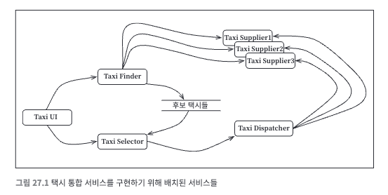
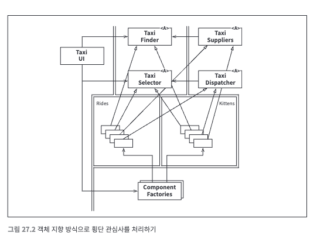
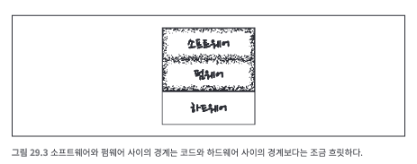

# 27장. 크고 작은 모든 서비스들

## 서비스 아키텍쳐
- 모든 서비스가 반드시 아키텍처 관점에서 중요해야만 하지는 않다.
- 기능을 프로세스나 플랫폼에 독립적이 되게끔 서비스를 생성하면 의존성 규칙 준수 여부와 관계없이 도움이 될 수 있다.
- 아키텍처적으로 중요한 서비스도 있지만 중요하지 않은 서비스도 존재한다.

## 서비스의 이점
### 결합 분리의 오류
- 시스템을 서비스들로 분리하면 각 서비스는 서로 다른 프로세스에서, 프로세서에서 실행된다.
- 이 프로세서 내의 또는 네트워크 상의 공유 자원 때문에 결합될 가능성이 존재한다.
- 이럴 때 이들 서비스는 강력하게 결합되어 버린다.
- 예를 들어, 서비스 사이를 오가는 데이터 레코드 사이에 새로운 필드를 추가하면 이 필드를 사용하는 모든 서비스에 변경이 전파된다.

### 야옹이 문제

- 위처럼 분리된 서비스는 얼핏 보면 잘 운영될 수 있지만 업무 규칙, 기능이 하나만 추가가 되어도 모든 서비스가 변경되어야할 수도 있다.
- 다시 말하면 이 서비스들은 모두 결합이 되어 있어 독립적으로 개발하고 배포하거나 유지도리 수 없다.
- 이것이 횡단 관심사가 가지는 문제이다.

## 객체가 구출하다
- 컴포넌트 기반 아키텍처는 SOLID 설계 원칙을 통해 다형적으로 확장할 수 있는 클래스 집합을 생성하여 새로운 기능을 처리하도록 하였다.

- 이 다이어그램의 클래스들은 서비스들과 거의 일치하지만 주목해야 할 것은 경계이다.
- 배차에 특화된 로직 부분은 Rides 컴포넌트로 추출되고 신규 기능은 Kittens 컴포넌트에 들어갔다.
- 이 두 컴포넌트는 기존 컴포넌트들에 있는 추상 기반 클래스를 템플릿 메서드나 전략패턴 등을 이용해 오버라이드 한다.
- 두 개의 신규 컴포넌트인 Rides와 Kittens는 의존성 규칙을 준수하며 이 기능들을 구현하는 클래스들은 UI 제어 하에 팩토리가 생성한다.
- 모든 서비스가 변경되어야 했던 이전과는 다르게 위의 다이어그램은 TaxiUI만 변경하면 된다.

## 횡단 관심사
- 이번 파트에서 배운 것은 아키텍처 경계가 서비스 사이에 있지 않다는 것이다.
- 아키텍처의 경계는 서비스를 관통하며 서비스를 컴포넌트 단위로 분할한다.
- 모든 주요 시스템이 직면하는 횡단 관심사를 처리하려면, 서비스 내부는 의존성 규칙도 준수하는 컴포넌트 아키텍처로 설계해야 한다.

# 28장. 테스트 경계

## 시스템의 컴포넌트인 테스트
- 아키텍처 입장에서 테스트는 모두 동일하다. TDD로 생성한 작은 테스트이든, 대규모 통합 테스트이든 아키텍처적으로는 모두 동등하다.
- 테스트는 세부적이며 구체적인 것으로 의존성 규칙을 따라 항상 테스트 대상이 되는 코드를 향한다.
- 시스템 내부의 어떤 것도 테스트에는 의존하지 않으며, 테스트는 시스템 컴포넌트를 향해 항상 안쪽으로 의존한다.
- 또한, 테스트는 독립적으로 배포 가능하다.

## 테스트를 고려한 설계
- 시스템에 강하게 결합된 테스트는 시스템이 변경될 때 함께 변경되어야 한다.
- 이는 '깨지기 쉬운 테스트 문제'로 알려져 있다.
- 깨지기 쉬운 테스트는 테스트의 보존을 위해 시스템이 뻣뻣해지는 경향이 있다.
- 따라서 설계 자체에서 테스트를 고려해야 한다.
- 변동성이 있는 것에 의존하는 테스트를 생성하면 안 된다.

## 테스트 API
- 그러기 위해서는 테스트가 모든 업무 규칙을 검증하는데 사용할 수 있도록 특화된 API를 만들면 된다.
- 테스트 API는 테스트를 애플리케이션에서 분리할 목적으로 사용하며 단순히 테스트를 UI에서 분리하는 것만이 아닌 테스트 구조를 애플리케이션
구조로부터 결합을 분리하는게 목표다.

### 구조적 결합
- 구조적 결합은 테스트 결합 중에서 가장 강력하며 가장 은밀하게 펴져나간다.
- 테스트 API는 애플리케이션의 구조를 테스트로부터 숨길 수 있어 상용 코드를 리팩터링하거나 진화시키더라도 테스트에는 전혀 영향을 주지 않는다.

# 29장. 클린 임베디드 아키텍처
- 소프트웨어는 닳지 않지만, 펌웨어와 하드웨어는 낡아 가므로 결국 소프트웨어도 수정해야 한다.
- 다시 말하면, 펌웨어와 하드웨어에 대한 의존성을 관리해야 한다.
- 어떻게 하면 임베디드 소프트웨어 아키텍처를 유지할 수 있는지, 소프트웨어가 오랫동안 유용하게 살아남을 수 있을까?

## 앱-티튜드 테스트
- 대부분의 임베디드 시스템 소프트웨어는 동작하게 만드는 것에 초점을 맞추고 올바르게, 빠르게 요구되는 성능을 만족하는 코드를 작성하지 않았다.
- 앱이 동작하도록 만드는 것을 개발자용 `앱-티듀드 테스트` 라고 부른다.

## 타깃-하드웨어 병목현상
- 임베디드가 지닌 특수한 문제 중 하나는 `타깃-하드웨어 병목현상` 이다.
- 임베디드 코드가 클린 아키텍처 원칙과 실천법을 따르지 않고 작성되면 대개의 경우 코드를 테스트할 수 있는 환경이 해당 특정 타깃으로 국한될 것이다.
- 그리고 그 타깃이 테스트가 가능한 유일한 장소라면 타깃-하드웨어 병목현상으로 인해 진척이 느려질 것이다.

### 클린 임베디드 아키텍처는 테스트하기 쉬운 임베디드 아키텍처다.
- **계층**
  - 하드웨어, 펌웨어, 소프트웨어 순으로 계층구조가 이루어진다고 가정하면,
  - 하드웨어는 기술의 발전과 무어의 법칙에 따라 변할 것이다.
  - 하드웨어를 변경해야 할 시점이 오면 임베디드 엔지니어는 필요 이상의 작업을 하지 않길 원할 것이다.
  - 소프트웨어가 펌웨어와 서로 섞이는 일은 안티 패턴이며 이 안티 패턴을 보이는 코드는 변화에 저항하게 된다.
  - 안티 패턴은 변경이 어렵고 위험하며 의도치 않은 결과를 불러온다.

- **하드웨어는 세부사항이다.**
  - 
  - 소프트웨어와 펌웨어 사이의 경계는 코드와 하드웨어 사이의 경계와는 달리 정의하기가 어렵다.
  - 임베디드 소프트웨어 개발자는 이 경계를 분명하게 만들어야 한다.
  - 소프트웨어와 펌웨어 사이의 경계는 하드웨어 추상화 게층(HAL)이라고 부른다.

- **HAL 사용자에게 하드웨어 세부사항을 드러내지 말라.**
  - HAL이 제대로 만들어졌다면, HAL은 타깃에 상관없이 테스트할 수 있는 경계층 또는 일련의 대체 지점을 제공한다.

- **프로세서는 세부사항이다.**
  - 임베디드 애플리케이션이 특수한 툴 체인을 사용한다면, 이러한 툴 체인은 도움이 되는 헤더 파일을 제공할 때가 많다.
  - 흔히 이런 툴 체인의 컴파일러는 C언어를 제멋대로 변경하여 해당 업체의 프로세서 기능에 접근하도록 키워드를 제공하는데 이렇게 되면 C처럼 보이는 코드는 더 이상 C언어가 아니게 된다.
  - 다른 프로세서에서는 컴파일되지 않고 동일한 프로세서라도 다른 컴파일러로는 컴파일하지 못할 수도 있다.
  - 모든 소프트웨어는 반드시 프로세서에 독립적이어야 함이 분염ㅇ하지만, 모든 펌웨어가 그럴 수는 없다.
  - 그렇기에 펌웨어가 저수준 함수들을 `프로세서 추상화 계층`의 형태로 격리하여 사용해야 한다.

- **운영체제는 세부사항이다.**
  - HAL은 필수적이나 실시간 운영체제, 임베디드 버전의 리눅스/윈도우는 사용한다면 충분하지는 않다.
  - 작성한 코드의 수명을 늘리려면, 운영체제를 세부사항으로 취급하고 의존하면 안 된다.
  - 이 또한, `운영체제 추상화 계층(OSAL)`을 통해 소프트웨어를 운영체제로부터 격리시킬 수 있다.

- **인터페이스를 통하고 대체 가능성을 높이는 방향으로 프로그래밍하라.**
  - HAL, OSAL처럼 모든 주요 계층 내부에서 관심사를 분리시키고 인터페이스를 활용하여 대체 가능성을 높이는 방향으로 프로그래밍하여야 한다.
  - 구현 세부사항의 가시성을 제한하고, 구현 세부사항은 변경될 것이라 가정해야 한다.
  - 클린 임베디드 아키텍처에서는 모듈들이 인터페이스를 통해 상호작용하기 때문에 각각의 계층 내부에서 테스트가 가능하다.

- **DRY원칙 : 조건부 컴파일 지시자를 반복하지 말라.**
  - 임베디드 시스템의 경우 타깃-하드웨어 유형을 식별하는 조건부 컴파일을 반복해서 사용하는 경우가 많은데 이는 `반복하지 말라(실용주의 프로그래머)` 원칙을 위배한다.
  - 이런 경우, HAL이 조건부 컴파일 대신 사용할 수 있는 일련의 인터페이스를 제공한다면, 링코 또는 실시간 바인딩을 통해 소프트웨어와 하드웨어를 연결할 수 있다.
