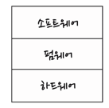
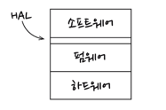
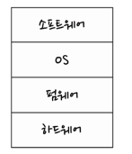
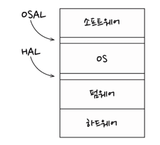

## 27 '크고 작은 모든' 서비스들
- 최근 유행 : 서비스 지향 아키텍처, 마이크로 서비스 아키텍처
  - 서비스를 사용하면 상호 결합이 분리되는듯, 배포 독립성을 지원하는것 처럼 보인다. -> 하지만 일부만 맞는말

### 서비스 아키텍처?
- 시스템의 아키텍처는 의존성 규칙을 준수하며 고수준 정책을 저수준의 세부사항으로부터 분리하는 경계에 의해 정의 
- 결국 서비스는 프로세스나 플랫폼 경계를 가로지르는 함수 호출에 지나지 않는다.

### 서비스의 이점?
- 결합 분리의 오류
  - 하나의 서비스 사이의 결합이 확실히 분리된다.
  - 서비스는 다른 서비스의 변수에 직접접근할 수 없고, 모든 서비스의 인터페이스는 반드시 잘 정의되어 있어야 한다.
- 개발 및 배포 독립성의 오류
  - 서비스를 사용함에 따라서 예측되는 또 다른 이점은 전담팀이 서비스를 소유하고 운영한다는 것이다. 
  - 대규모 엔터프라이즈 시스템은 서비스 기반 시스템외에도 MSA, CSP(컴포넌트) 구축할 수 있다는 사실은 증명되어 왔다. 
  - 결합 분리의 오류에 따르면 서비스라 해서 항상 독립적으로 개발, 배포, 운영할 수 있는것은 아니다.

### 야옹이 문제 
- 서비스들의 존재는 이전과 달라진게 없지만, 각 서비스의 내부는 자신만의 컴포넌트 설계로 되어 있어서 파생 클래스를 만드는 방식으로 신규 기능을 추가할 수 있다. 파생 클래스들은 각자의 컴포넌트 내부에 놓인다.

### 횡단 관심사
- 아키텍처 경계가 서비스 사이에 있지 않다
- 오히려 모든 서비스를 관통하며 컴포넌트 단위로 분할한다. 
- 서비스 내부는 의존성 규칙도 준수하는 컴포넌트 아키텍처로 설계해야 한다.

### 결론
- 서비스는 시스템 확장성과 개발 가능성 측면에서는 유용하지만, 그 자체로는 아키텍처적으로 그리 중요한 요소는 아니다
- 서비스는 단 하나의 아키텍처 경계로 둘러싸인 단일 컴포넌트로 만들 수 있다.
- 혹은 여러 아키텍처 경계로 분리된 다수의 컴포넌트로 구성할 수도 있다. 
- 드물게는 클라이언트와 서비스가 강하게 결합되어 있어 아키텍처적으로 아무런 의미가 없을 때도 있다.

## 28 테스트 경계
- 테스트는 시스템의 일부이고 아키텍처에도 관여한다.

### 시스템 컴포넌트인 테스트
- 어떤 종류의 테스트이든 아키텍처 관점에서는 동일하다.
- 테스트는 태생적으로 의존성 규칙을 따른다.
- 또한, 테스트는 독립적으로 배포 가능하다.(가장 고립되어있다)

### 테스트를 고려한 설계
- 테스트가 시스템의 설계와 잘 통합되지 않으면 테스트는 깨지기가 쉬워지고 시스템은 뻣뻣해져서 변경하기가 어려워진다.
- 문제는 결합이다. (시스템이 수정될떄 마다 변경해야한다.)
- 깨지기 쉬운 시스템 == 시스템이 수정되게 어렵게 만든다. 

### 테스트 API
- 테스트가 모든 업무 규칙을 검증하는 데 사용할 수 있도록 특화된 API를 만들면 된다.
- 사용자 인터페이스가 사용하는 인터랙터 인터페이스 어댑터 들의 상위 집합이 될것이다. 
- 단순히 테스트를 UI에서 분리하는 것만이 아닌, 테스트 구조를 애플리케이션 구조로 부터 결합을 분리하는게 목표다.

- 구조적 결합
  - 테스트 API의 역할은 애플리케이션의 구조를 테스트로부터 숨기는 데 있다.
  - 리객토링 시에도 테스트에는 영향을 주지 않다 따로 따로 진화할 수 있다는 점이 있따. 
  - 테스트 코드는 점점 구체적여 지고 상용 코드는 점점 추상적여 지지만 서로간의 영향이 없다.
- 보안
  - 테스트 API가 지닌 힘을 운영 시스템에 배포하면 위험에 처할 수 있다.
  - 테스트 API 자체와 테스트 API중 위험한 부분의 구현부는 독립적으로 배포할 수 있는 컴포넌트로 분리해야한다.

### 결론
- 테스트는 시스템의 일부다.
- 테스트를 통해 안정성의 이점을 얻고자 하면 테스트는 잘 설계되어야 한다.
- 그렇지 않으면 유지보수가 힘들어 결국 버려질것이다.

## 29 클린 임베디드 아키텍처
`소프트웨어는 닳지 않지만 펌웨어와 하드웨어는 낡아 가기에 소프트웨어도 수장해야한다. - 더그`
`소프트웨어는 닳지 않지만 펌웨어와 하드웨어에 대한 의존성을 관리하지 않으면 안으로푸터 파괴될수 있다.`
소프트웨어를 하드웨어로 부터 분리해야한다. 
어떻게 해야 임베디드 SW 아키텍처를 깔끔하게 유지할 수 있는가?

### 앱티튜드 테스트
- 켄트백 "먼저 동작하게 만들어라 -> 올바르게 만들어라 -> 그리고 빠르게 만들어라" 
- 앱이 동작하도록 만드는것을 개발자용 앱티튜드 테스트라 부른다. (오직 앱이 동작하게만 만든다.)

### 타깃 - 하드웨어 병목현상
- 임베디드 개발자들은 제한된 메모리 공간, 실시간성 제약과 처리 완료 시간, 제한된 입출력 등.. 을 고려해야한다.
- 임베디드 엔지니어는 특별하다 
- 클린 임베디드 아키텍처는 테스트하기 쉬운 임베디드 아키텍처다
  - 병목현상을 줄이는 방법을 알아보다
  - 계층
    - 
    - 위와 같은 3계층에서 다른모듈에 대해 어디까지 알게 할지를 신중하게 처리하지 않는 경우 아래와 같이 변화한다.
    - 
    - 이는 안티 패턴이다.
  - 하드웨어는 세부사항이다.
    - 소프트웨어와 펌웨어 사이의 경계는 하드웨어 추상화 계층이라 부른다(HAL)
    - 
  - HAL 사용자에게 하드웨어 세부사항을 드러내지 말라
    - HAL을 제대로 만들었다면 HAL은 타깃 상관없이 테스트할 수 있는 경계층 또는 일련의 대체 지점을 제공한다.
  - 프로세서는 세부사항이다. 
    - 클린 임베디드 아키텍처라면 이들 장치 접근 레지스터를 직접 사용하는 코드는 소수의, 순전히 펌웨어로만 한정 시켜야한다.
    - 이러한 마이크로 컨트롤러를 사용할 떄 펌웨어가 저수준 함수들을 프로세서 추상화 계층(PAL)의 형태로 격리시켜줄 수 있다. 
    - 운영체제는 세부사항이다. 
      - HAL은 필수적이다. 
      - 베어멘탈(OS가 없는 임베디드 시스템) 시스템이라면 HAL만으로 충분하다.
      - 하지만 실시간 운영체제(RTOS)를 사용하는 등의 일이 발생하면 힘들어 진다. 
      - 작성한 코드의 수명을 늘리려면 운영체제를 세부사항으로 취급하고 운영체제에 의존하는 일을 막아야 한다.
      - 새로운 OS가 제공하는, 이전 OS와는 다른 기능과 시스템 명령어에 맞게 그 의미 자체를 조정해야 할 가능성이 높다.
      - 
      - 클린 임베디드 아키텍처는 추상화 계층을 두어 SW를 OS로 부터 격리 시킨다. 
      - 
      중복이 그다지 큰 비용은 추가로 초래하지 않아 모든 공통 구조를 가지도록 하여 코드 비대화에도 큰 영향을 미치지 않는다.
      - 또한 이를 통해 테스트 지점을 찾는것에 도움을 얻을 수 있다.
      - 클린 임베디드 아키텍처를 따른 소프트웨어는 타깃 운영체제에 관계없이 테스트할 수 있다.
      - 제대로 만든 OSAL은 타깃과는 별개로 테스트할 수 있도록 해주는 경계층 또는 일련의 대체 지점을 제공한다.
  
### 인터페이스를 통하고 대체 가능성을 높이는 방향으로 프로그래밍 하라
- HAL을 추가하거나 때로는 OSAL 을 추가해야할 뿐만 아니라 주요 계층에 대한 원칙을 정의해야할 수 있다. 
- 이들 원칙은 관심사를 분리 시키고 인터페이스를 활용하며 대체 가능성을 높이는 방향을 프로그래밍하도록 유도한다.
- 구현 세부사항의 가시성을 제한하라. 

### DRY 원칙 : 조건부 컴파일 지시자를 반복하지 마라.
- 코드를 반복하는 일은 반복하지 마라 
- 만약 추상화 계층이 있다면 어떨까? HAL조건부 컴파일 대신 사용할 수 있는 일련의 인터페이스를 제공한다면 우리는 링커 또는 어떤 형태의 실시간 바인딩을 사용해서 소프트웨어를 하드웨어와 연결할 수 있다.

### 결론
- 모든 코드가 펌웨어가 되도록 내버려두면 제품이 오래 살아남을 수 없게 된다.
- 오직 타깃 하드웨어에서만 테스트할 수 있는 제품도 마찬가지다. 
- 클린 임베디드 아키텍처는 제품이 장기간 생명력을 유지하는 데 도움을 준다.
