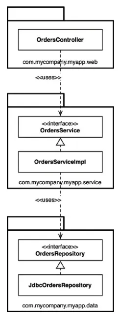

# 30장. 데이터베이스는 세부사항이다.

## 관계형 데이터베이스

- 관계형 데이터베이스는 데이터를 저장하고 접근하는데 탁월한 기술이지만 결국 그저 기술일 뿐이며, 세부사항임을 뜻함
- 데이터를 테이블에 행 단위로 배치한다는 자체는 아키텍처적으로 전혀 중요하지 않음
- 유스케이스는 이러한 방식을 알아서는 안되며 관여해서도 안됨
- 데이터가 테이블 구조를 가진다는 사실은 오직 아키텍처의 외부 원에 위치한 최하위 수준의 유틸리티 함수만 알아야 함

## 하지만 성능은?

- 성능은 당연히 아키텍처적인 관심사이지만, 데이터 저장소의 측면에서는 완전히 캡슐화하여 업무 규칙과 분리할 수 있는 관심사
- 데이터 저장소에서 데이터를 빠르게 넣고 뺄 수 있어야 하는 것은 맞지만, 이는 저수준의 관심사
- 이는 저수준의 데이터 접근 메커니즘 단에서 다룰 수 있고, 성능은 전반적인 아키텍처와는 아무런 관련이 없다

## 결론

- 체계화된 데이터 구조와 데이터 모델은 아키텍처적으로 중요함
- 하지만 데이터를 회전식 자기 디스크 표면에서 이리저리 옮길 뿐인 기술과 시스템(데이터베이스)은 아키텍처적으로 중요하지 않음
- 데이터를 테이블 구조로 만들고, SQL로만 접근하도록 하는 관계형 데이터베이스 시스템은 전자보다는 후자에 훨씬 가까움
- 데이터는 중요하지만 데이터베이스는 세부사항임

# 31장. 웹은 세부사항이다.

- 웹은 입출력장치이자 GUI이며 GUI는 세부사항이므로, 이를 핵심 업무 로직에서 분리된 경계 바깥에 두어야 함
- UI와 애플리케이션 사이에는 추상화가 가능한 또 다른 경계가 존재함
- 비즈니스 로직은 다수의 유스케이스로 구성되며, 각 유스케이스는 사용자를 대신해서 일부 함수를 수행하는 것으로 볼 수 있음
- 각 유스케이스는 입력 데이터, 수행할 처리 과정, 출력 데이터를 기반으로 기술할 수 있음

# 32장. 프레임워크는 세부사항이다.

## 혼인 관계의 비대칭성

- 우리는 프레임워크를 위해 대단히 큰 헌신을 해야 하지만, 프레임워크 제작자는 우리를 위해 아무런 헌신도 하지 않음
    - 프레임워크를 사용할 경우 우리는 프레임워크 제작자가 제공하는 문서를 꼼꼼히 읽음
    - 이 문서에서는 우리가 만들 소프트웨어와 프레임워크를 어떻게 통합할 수 있을지 조언함
    - 대개의 경우 이들은 프레임워크를 중심에 두고, 우리의 아키텍처는 그 바깥을 감싸야 한다고 말함
- 프레임워크 제작자는 당신의 애플리케이션이 가능하면 프레임워크에 공고하게 결합될 것을 강하게 역설함
- 프레임워크 제작자 입장에서는 프레임워크에 대해 절대적인 제어권을 쥐고 있으므로 오히려 결합되기를 바람
- 한번 결합하면 그 관계를 깨기가 매우 어렵기 때문이며, 이러한 관계는 일방적임

## 해결책

- 프레임워크를 사용할 수 있지만 프레임워크와 결합해서는 안되고, 적당히 거리를 둬야 함
- 프레임워크가 자신의 클래스로부터 파생을 요구한다면 프록시를 만들고, 업무 규칙에 플러그인할 수 있는 컴포넌트에 위치시켜야 함
- 프레임워크를 아키텍처의 바깥쪽 원에 속하는 세부사항으로 취급하고 아키텍처의 안쪽 원으로 들어오지 못하게 해야 함
- 핵심 코드에 플러그인 할 수 있는 컴포넌트에 프레임워크를 통합하고, 의존성 규칙을 준수해야 함
- 스프링은 훌륭한 의존성 주입 프레임워크이지만 ,업무 객체는 @Autowired 등을 포함해 절대로 스프링에 대해 알아서는 안됨

# 33장. 사례 연구: 비디오 판매

- 예시로 살펴볼 제품은 웹사이트에 비디오를 판매하는 소프트웨어로, 비디오들을 개인과 기업에게 웹으로 판매함
    - 개인은 단품 가격을 지불해 스트리밍으로 보거나, 더 높은 가격을 내고 비디오를 다운로드해서 영구소장할 수 있음
    - 기업용 라이센스는 스트리밍 전용이며, 대량 구매를 하면 할인을 받을 수 있음
    - 일반적으로 개인은 시청자인 동시에 구매자이지만, 기업은 비디오를 구매하는 사람이 따로 있음
    - 비디오 제작자는 비디오 파일과 비디오 해법에 대한 설명서, 부속 파일(시험, 문제, 해법, 소스 코드 등)을 제공해야 함
    - 관리자는 신규비디오 시리즈물을 추가하거나 기존 시리즈물에 비디오를 추가/ 삭제하며, 다양한 라이센스에 맞춰 가격을 책정함
- 시스템의 초기 아키텍처를 결정하는 첫 단계는 액터와 유스케이스를 식별하는 일임

## 유스케이스 분석

- 4개의 주요 액터는 시스템이 변경되어야 할 네 가지 주요 근원임
    - 신규 기능을 추가하거나 기존 기능을 변경해야 한다면, 그 이유는 반드시 이들 액터 중 하나에게 기능을 제공하기 위함임
    - 따라서 시스템을 분할하여, 특정 액터를 위한 변경이 나머지 액터에게는 전혀 영향을 미치지 않게 만들어야 함
- 중앙의 점선으로 된 유스케이스는 추상 유스케이스임
    - 추상 유스케이스는 범용적인 정책을 담고 있으며 다른 유스케이스에서 이를 더 구체화함
    - 시청자 입장의 카탈로그 조회하기와 구매자 입장의 카탈로그 조회하기는 모두 추상 유스케이스를 상속받음
    - 이는 꼭 생성해야만 했던 것은 아니며, 이를 다이어그램에서 없애더라도 전체 제품의 기능을 조금도 손상시키지 않음
    - 그러나 이들은 너무 비슷하기 때문에, 유사성을 식별해서 분석 초기에 통합하는 방법을 찾는 편이 더 현명하다고 판단했음

## 컴포너틑 아키텍처

- 터와 유스케이스를 식별했으므로, 예비 단계의 컴포넌트 아키텍처를 만들어볼 수 있음
    - 늘 그렇듯이 이중으로 된 선은 아키텍처 경계를 나타냄
    - 뷰, 프레젠터, 인터랙터, 컨트롤러로 분리된 전형적인 분할 방법을 확인할 수 있음
    - 또한 대응하는 액터에 따라 카테고리를 분리했다는 사실도 확인할 수 있음
    - 각 컴포넌트는 단일 jar 파일에 해당한며, 이들 컴포넌트는 자신에게 할당된 뷰, 프레젠터, 인터랙터, 컨트롤러를 포함함
- CatalogView와 Catalog Presenter는 특수한 컴포넌트임
    - 이는 카탈로그 조회하기라는 추상 유스케이스를 처리하는 나만의(로버트 마틴 만의) 방식임
    - 이 뷰와 프레젠터는 해당 컴포넌트 내부에 추상 클래스로 코드화 될 것임
    - 그리고 상속받는 컴포넌트에서는 이들 추상 클래스로부터 상속받은 뷰와 프레젠터 클래스들을 포함함
- 시스템을 여러 컴포넌트로 분할해서 여러 개의 .jar로 전달해야 할까?
    - 이는 그럴수도 있고 아닐수도 있음
    - 대신 컴파일과 빌드 환경은 분명히 이 형태로 나눌 것이며, 컴포넌트를 독립적으로 전달할 수 있게 빌드하는 것도 가능할 것임
    - 또한 전달해야 할 이 모든 단위를 더 적은 개수로 합칠 수 있는 권한도 가지고 있다.
    - 선택지를 열어두면, 후에 시스템이 변경되는 양상에 맞춰 배포 방식을 조정할 수 있음

# 34장. 빠져있는 장

## 계층 기반 패키지

- 가장 단순한 첫 번째 설계 방식은 전통적인 수평 계층형 아키텍처임
- 기술적인 관점에서 해당 코드가 하는 일에 기반해 코드를 분할하며, 이를 계층 기반 패키지라고 함
- 전형적인 계층형 아키텍처에는 웹, 업무 규칙, 영속성 코드를 위한 계층이 하나씩 존재함

## 기능 기반 패키지

- 기능 기반 패키지 구조는 연관된 기능, 도메인 개념 또는 에그리거트 루트에 기반하여 수직의 얇은 조각으로 코드를 나누는 방식임
- 전형적으로 모든 타입이 하나의 자바 패키지에 속하며, 패키지 이름은 그 안에 담긴 개념을 반영해서 지음

## 포트와 어댑터

- 코드 베이스는 내부(도메인)와 외부(인프라)로 구성됨을 흔히 볼 수 있음
- 내부는 도메인 개념을 모두 포함하는 반면, 외부는 외부 세계(UI, DB 등)와의 상호작용을 포함함
- 여기서 핵심 규칙은 바로 외부가 내부에 의존하며, 절대로 그 반대로는 안된다는 점임

## 컴포넌트 기반  패키지

- 계층형 아키텍처의 목적은 기능이 같은 코드끼리 분리하는 것으로 웹은 업무 로직으로부터, 업무 로직은 데이터 접근으로부터 분리함
- 엄격한 계층형 아키텍처에서는 의존성 화살표가 항상 아래로 향해야 하며, 각 계층은 반드시 아래 계층에만 의존해야 함
- 하지만 의도치 않은 방식으로 의존성을 추가하더라도, 잘못되었지만 보기에는 여전히 좋은 비순환 의존성 그래프가 생성됨
- 예를 들어 OrdersController에서 OrdersRepositry를 주입하여 코드가 동작하도록 만든 결과는 다음과 같음

## 결론

- 이 장은 최적의 설계를 꾀했더라도, 구현 전략에 얽힌 복잡함을 고려하지 않으면 설계가 순식간에 망가질 수도 있음을 강조함
- 설계를 어떻게 해야만 원하는 코드 구조로 매핑할 수 있을지, 그 코드를 어떻게 조직화할지 고민해야 함
- 또한 런타임과 컴파일타임에 어떤 결합분리 모드를 적용할지를 고민해야 함
- 가능한 선택사항을 열어두되 실용주의적으로 행하고, 팀의 규모와 기술 수준, 해결책의 복잡성을 제약(일정과 예산)과 고려해야 함
- 또한 선택된 아키텍처 스타일을 강제하는데 컴파일러의 도움을 받을 수 있을지를 고민해야 함
- 그리고 데이터 모델과 같은 다른 영역에 결합되지 않도록 주의해야 하는데, 구현 세부사항에는 항상 문제가 있는 법임