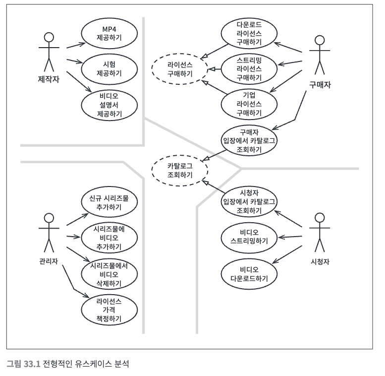
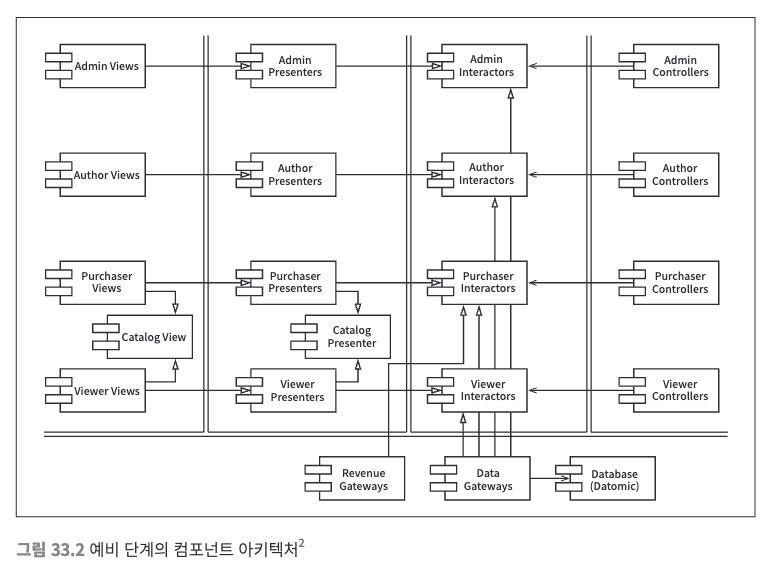
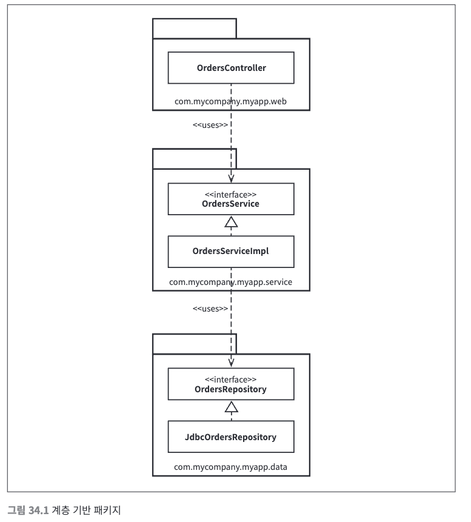
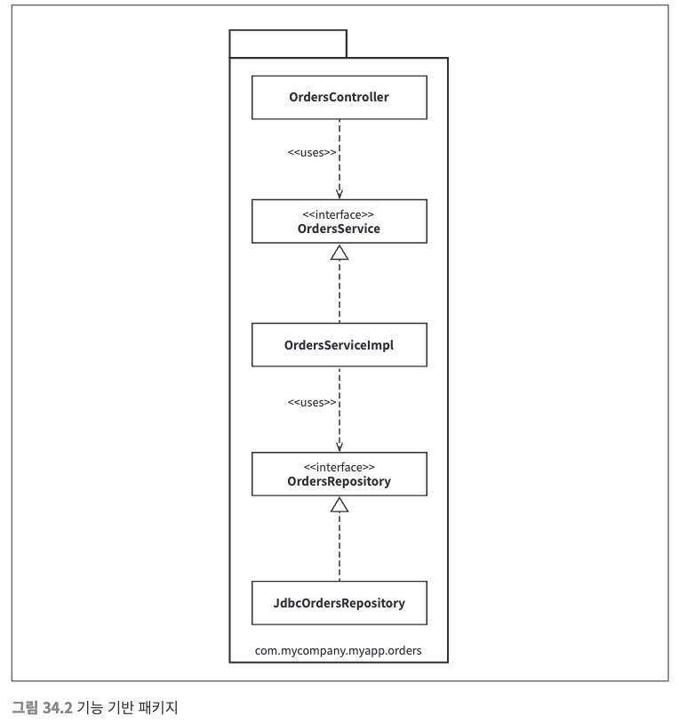
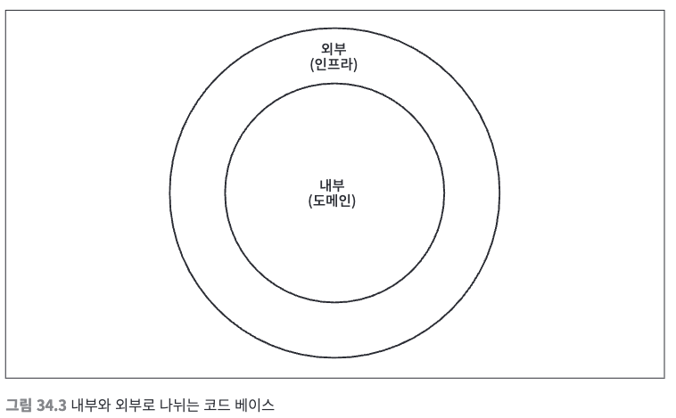
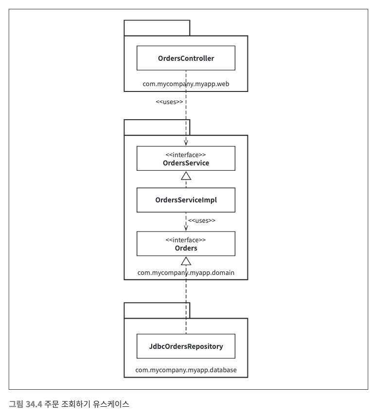
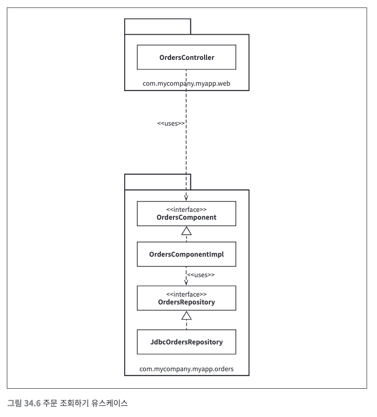

# 30장. 데이터베이스는 세부사항이다.

### 관계형 데이터베이스
- 관계형 테이블은 특정한 형식의 데이터에 접근하는 경우에는 편리하지만, 데이터를 테이블에 행 단위로 배치한다는 자체는 아키텍처적으로 전혀 중요하지 않다.
- 애플리케이션의 유스케이스는 이러한 방식을 알아서는 안되며 관여해서도 안 되며 데이터가 테이블 구조를 가진다는 사실은 오직 아키텍처의 외부 원에 위치한 최하위 수준의 유틸리티 함수만 알아야 한다.
- 데이터 접근 프레임워크가 테이블과 행이 객체 형태로 시스템을 돌아다니는 것은 잘못된 설계다.

### 세부사항
- 데이터베이스는 디스크 표면과 RAN 사이에서 데이터를 옮겨 담는 매커니즘에 불과하며 아키텍처 관점에서 데이터의 형태는 신경써서는 안 된다.

### 성능
- 데이터 저장소의 측면에서 성능은 완전히 캡슐화하여 업무 규칙과는 분리할 수 있는 관심사다.
- 성능은 시스템의 전반적인 아키텍처와는 아무런 관련이 없다.

# 31장. 웹은 세부사항이다.

### 끝없이 반복하는 추
- 웹이 등장할 시기에 클라이언트-서버 아키텍처를 밀어냈지만 웹 또한 현재 기나긴 진동의 끝에 있을 뿐이다.
- 아키텍처는 멀리 내다보기 위해 이 진동을 핵심 업무 규칙의 중심에서 멀리 밀어내야 하는 단기적인 문제로 인식해야 한다.

# 32장. 프레임워크는 세부사항이다.

### 혼인 관계의 비대칭성
- 대개의 경우, 개발자들은 프레임워크를 중심에 두고 우리의 아키텍처로 바깥을 감싸야 한다고 생각한다.
- 프레임워크 제작자는 당신의 애플리케이션이 가능하면 프레임워크에 공고하게 결합된 것을 강하게 역설한다.
- 이러한 방식은 일방적이며 모든 위험과 부담은 오롯이 사용자가 감당해야 한다.

### 위험요인
1. 프레임워크는 의존성 규칙을 위반하는 경향이 있다.
2. 제품이 성숙해지면 프레임워크가 제공하는 기능과 틀을 벗어나게 된다.
3. 프레임워크가 사용자에게 도움되지 않는 방향으로 진화할 수도 있다.
4. 새롭고 더 나은 프레임워크가 계속해서 등장할 수 있다.

### 해결책
- 프레임워크를 사용하되 거리를 두고, 프레임워크를 세부사항으로 취급해야 한다.
- 업무 객체를 만들 때 프레임워크가 자신의 기반 클래스로부터 파생하기를 요구한다면 프록시를 만들고 업무 규칙에 플러그인할 수 있는 컴포넌트에 프록시를 위치시킨다.
- 필수적인 프레임워크도 존재하지만 결코 가볍게 받아들여서는 안 된다.

# 33장. 사례 연구 : 비디오 판매

### 제품
- 비디오를 판매하는 소프트웨어
- 개인은 단품을 통해 스트리밍 또는 다운로드 가능
- 기업은 스트리밍 전용

### 유스케이스 분석

- 네 개의 주요 액터는 단일 책임 원칙에 따라 시스템이 변경되어야 할 주요 근원이 된다.
- 중앙의 점섬으로 이루어진 유스케이스는 추상 유스케이스이다.
- 추상 유스케이스는 범용적인 정책을 담고 있으며 다른 유스케이스에서 이를 더 구체화한다.

### 컴포넌트 아키텍처

- 이중으로 된 선은 아키텍쳐 경계로 뷰, 프레젠터, 인터랙터, 컨트롤러로 분리하였다.
- 각 컴포넌트는 jar파일 또는 단일 dll파일에 해당한다.
- 하지만 모든 컴포넌트들을 분할해서 여러 개의 jar나 dll파일로 전달할 필요는 없다.
- 다양한 선택지를 열어 두면 이후 시스템이 변경되는 양상에 맞춰 시스템 배포 방식을 조절할 수 있다.

# 34장. 빠져 있는 장
- 온라인 서점 구축 프로젝트에서 고객이 주문 상태를 조회할 수 있어야 한다는 유스케이스를 구현해야 한다고 가정.

### 계층 기반 패키지
- 가장 단순한 설계 방식은 전통적인 수평 계층형 아키텍처(계층 기반 패키지)이다.
- 기술적인 관점에서 해당 코드가 하는 일에 기반해 그 코드를 분할하는 것이다.

- 소프트웨어를 작동시키는 아주 빠른 방법이지만 소프트웨어가 복잡해지면 더 잘게 모듈화를 고민하게 될 것이다.
- 또한, 계층형 아키텍처는 업무 도메인에 대해 아무것도 말해주지 않는다.

### 기능 기반 패키지
- 서로 연관된 기능, 도메인 개념에 기반하여 수직의 얇은 조각으로 코드를 나누는 방식이다.

- 인터페이스와 클래스는 계층 기반 패키지와 같지만 모두 하나의 패키지에 속한다.
- 이로서 코드의 상위 수준 구조가 업무 도메인에 대해 무언가를 알려주게 된다.
- '주문 조회하기' 유스케이스가 변경될 경우 하나의 패키지에 코드가 담겨 있기 때문에 변경되어야 할 부분을 찾기가 쉽다.

### 포트와 어댑터
- 엉클 밥에 따르면 '포트와 어댑터' 방식으로 접근하는 이유는 업무/도메인에 초점을 둔 코드가 프레임워크나 데이터베이스 같은 기술적인 세부 구현과 독립적이며 분리된 아키텍처를 만들기 위해서다.

- 내부 영역은 도메인 개념을 모두 포함하는 반면, 외부 영역은 UI, 데이터베이스 등의 상호작용을 포함한다.
- 규칙은 외부가 내부에 의존하며 그 반대는 이루어지지 않아야 한다는 것이다.

- domain이 내부이며 나머지 패키지는 외부다.
- 의존성이 내부를 향해 흐른다.

### 컴포넌트 기반 패키지
- 계층형 아키텍처의 목적은 기능이 같은 코드를 묶어서 서로 분리하는 것이다.
- 웹 관련 코드는 업무 로직에서 분리하고 업무 로직은 다시 데이터 접근으로부터 분리한다.

- "컴포넌트는 배포 단위다. 컴포넌트는 시스템의 구성요소로 배포할 수 있는 가장 작은 단위다."
- 컴포넌트 기반 패키지는 큰 단위의 컴포넌트와 관련된 모든 책임을 하나의 자바 패키지로 묶는데 주안점을 둔다.
- 컴포넌트 기반 패키지의 주된 이점은 주문과 관련된 무언가를 코딩해야 할 때 오직 한 곳만 보면 된다는 것이다.

### 구현 세부사항엔 항상 문제가 있다.
- 모든 타입에서 public 지시자를 사용하는 것은 프로그래밍 언어가 제공하는 캡슐화 관련 이점을 활용하지 않는다는 것이다.

### 다른 결합 분리 모드
- 프로그래밍 언어가 제공하는 방법 외에도 소스 코드 의존성을 분리하는 방법은 존재할 수 있다.
- 예를 들면, 모듈 프레임워크, 자바9에서 제공하는 새로운 모듈 시스템 등
- 빌드 도구를 사용해서 모듈이나 프로젝트가 서로 분리되도록 구성해야 한다.
- 또는, 소스 코드 수준에서 의존성을 분리하는 방법도 있다. (서로 다른 소스 코드트리로 분리)
- 하지만 이 방식은 너무 이상적으로 현실에서는 성능, 복잡성, 유지보수 문제가 생기기 마련이다.
- 포트와 어댑터 접근법을 사용하면 소스 트리를 두 개만 만들어서 더 간단하게 사용하기도 한다.
  - 도메인 코드(내부)
  - 인프라 코드(외부)