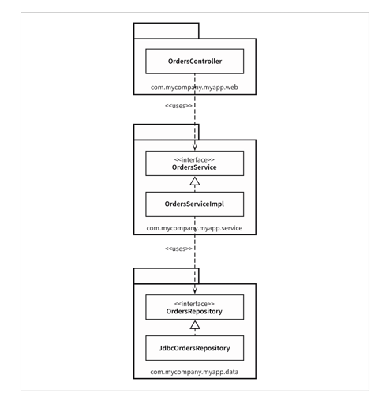
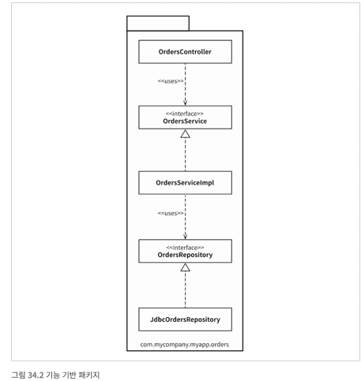
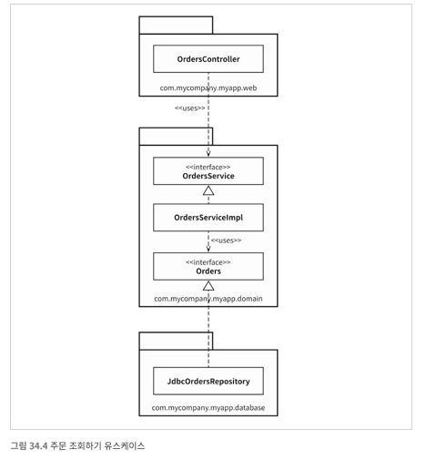
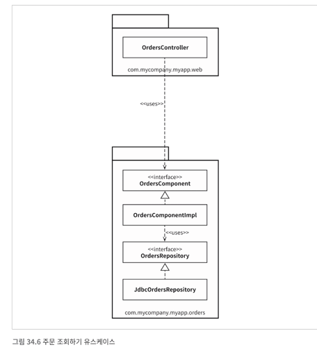

# 6장 세부사항

## 30장 데이터베이스는 세부사항이다

데이터 베이스는 데이터에 접근할 방법을 제공하는 유틸리티다.
아키텍처 관점에서 보면 이러한 유틸리티는 저수준의 세부사항이기에 아키텍처와 관련이 없다.
뛰어난 아키텍트라면 저수준의 메커니즘이 시스템 아키텍처를 오염시키는 일을 용납하지 않는다.

### 관계형 데이터 베이스

관계형 데이터 베이스는 기술일 뿐이고 결국에는 세부사항임을 의미한다.

### 데이터베이스 시스템은 왜 이렇게 널리 사용되는가?

oracle, mysql, sql서버가 우위를 차지할 수 있던 이유는 무엇일까 한마디로 말하면 디스크 떄문이었다.
디스크에서 내용을 불러오는데 많은 시간이 소요되고 이에 캐싱시스템 등을 도입하기 위하여 데이터베이스 시스템을 사용하였다.

### 디스크가 없다면 어떻게 될까?

디스크는 점점 램으로 진화되고 있다.
만약 램으로 전환된다면 굳이 데이터를 테이블 형태로 저장하지 않을것이다. 자료구조를 사용할것이다.

### 세부사항

이러한 현실 때문에 데이터 베이스는 세부사항 이다.
따라서 아키텍처 관점에서 본다면 회전식 자기 디스크에 데이터가 있기만 한다면, 데이터가 어떤 형태인지는 절대로 신경 써서는 안된다.

### 하지만 성능은?

데이터 저장소 측면에서는 업무규칙과 불리할 수 있다는 특징이 있다.
하지만 이도 저수준의 데이터 접근 매커니즘이다.

### 결론
체계화된 데이터 구조와 데이터 모델을 아키텍처 적으로 중요하다. 반면 그저 데이터를 회전식 자기 디스크 표면에서 이리저리 옮길 뿐인 기술과 시스템은 아키텍처적으로 중요치 한다. 데이터를 테이블 구조로 만들고
SQL로만 접근하도록 하는 관계형 데이터베이스 시스템은 전자보다는 후자와 훨씬 관련이 깊다. 데이터는 중요하다. 데이터베이스는 세부사항이다.

## 31장 웹은 세부사항이다 (ME)

GUI는 세부사항이다. 웹은 GUI다. 따라서 웹은 세부사항이다.
오나전환 입력 데이터와 그에 따른 출력 데이터는 데이터 구조로 만들어서 유스케이스를 실행하는 처리 과정의 입력 값과 출력값으로 사용할 수 있다.
이 방식을 따르면 각 유스케이스가 장치 독립적인 방식으로 UI라는 입출력 장치를 동작시킨다고 간주할 수 있다.

## 32장 프레임워크는 세부사항이다

### 프레임 워크 제작자

당신이 무엇을 필요로 하는지 고려하지 않는다.
겹치는 영역이 클뿐 모든것을 커버하지 않는다. 하지만 겹치는 영역이 크면 클수록 유용해진다.

### 혼인 관계의 비 대칭성

당신은 프레임워크를 위해 대단히 큰 헌신을 해야하지만, 프레임워크 제작자는 당신을 위해 아무런 헌신도 하지 않는다.
프레임워크를 사용한다는것은 의존 해야하는 것을 의미한다.
위험과 부담은 당신이 부담해야하고 제작자가 감수하는것은 없다.

### 위험 요인

1. 프레임워크의 아키텍처는 그다지 갈끔하지 않다.
2. 제품이 성숙해지면서 프레임워크가 제공하는 기능과 틀을 벗어나게 될 것이다.
3. 프레임 워크가 당신에게 도움되지 않는 방향으로 진화할 수 있다.
4. 새롭고 더 나은 프레임워크가 등장해서 갈아타고 싶을 수도 있다.

### 해결책

- 프레임 워크와 결혼하지 마라.
    - 결합해서는 안된고 적당히 거리르 두가.
    - 프레임 워크 기반 클래스로 부터 파생하지 말고 프록시를 만들어서 위치시켜라
        - 예시로 스프링에서는 Autowired 어노테이션을 업무 객체에 산재 시켜서는 안되며 스프링에 대해서 알아서는 안된다. Main에서 의존성을 삽입하는것이 낫다.

### 결론

자바의 표준 라이브와 같이 반드시 의존해야하지만 그렇지 않은 경우 바로 적용하려 하지 말아라. 오랫동안 사용가능할 프레임 워크일지 확인하고 아키텍처 경계 너머에 두어라

## 33장 사례 연구: 비디오 판매 (ME)

1. 유스케이스 분석
2. 의존성 관리
    - 오른쪽에서 왼쪽을 카리키지는 않음을 주목하라.
    - 저수준의 세부사항에서 발생한 변경이 상위로 파급되어서 상위수준의 정책에 영향을 미치지는 않음을 보장할 수 있다.

### 결론

- 단일 책임 워틱에 기반한 엑터의 분리
- 의존성 규칙

이는 서로다른 속도로 변경되는 컴포넌트를 분리하는데 목적이 있다. 정책 수준과 관련이 있다.
이런 방식으로 코드를 구조화 한다면 시스템을 실제로 배포하는 방식은 다양하게 선택할 수 있게 된다. 상황에 맞게 컴포넌트들을 배포 가능 한 단위로 묶을 수도 있고 상황에 따라 묶는 단위를 바꾸기도 편리하다.

## 34장 빠져 있는 장

설계나 코드 조직화와 관련된 몇가지 접근법을 살펴 보자.

### 계층 기반 패키지

전통적인 방식으로 수평 게층형 아키텍처다.
계층형은 주로 아례 계층에만 의존해야한다.  

### 기능 기반 패키지

서로 연관된 기능이나 도메인을 기반하여 수직의 얇은 조각으로 코드를 나누는 방식이다.
이를 사용하면 변경해야할 코드가 한 패키지에 닮겨 있게 된다.   

### 포트와 어뎁터

내부와 외부를 분리한다.   

### 컴포넌트 기반 패키지

웹커트롤러는 절대로 리포지토리에 직접 접근해서는 안된다.와 같은 원칙이 필요하다.
아예 빌드를 실패하게 하여 이를 해결 하도록 할 수 있다.
컴포넌트 기반 패키지를 도입해야하는 이유:서비스 중심적인 시각으로 소프트웨어를 시스템을 바라보며, 마이크로서비스 아키텍처가 가진 시각과도 동일하다.   

### 구현 세부사항엔 항상 문제가 있다.

세부사항을 잘못 구현하면 이런 견해도 빠르게 흐트러지게 시작한다.

### 결론

구현 전략에 얽힌 복잡함을 고려하지 않으면 설계가 순식간에 망가질 수도 있다는 사실을 강조하는데 그 목적이 있다.
선택사항을 열어두되 실횽주의적으로 행하라
선택된 아키텍처 스타일을 강제하는데 컴파일러의 도움을 받을 수 있을지 고민하며, 데이터 모델과 같은 다른 영역에 결합되지 않도록 주의하라. 구현 세부사항에는 항상 문제가 있는 법이다.

## 부록

조합 최계 시스템 -> .. (언젠가 읽고 꼭 채우겠습니다.. 네..)